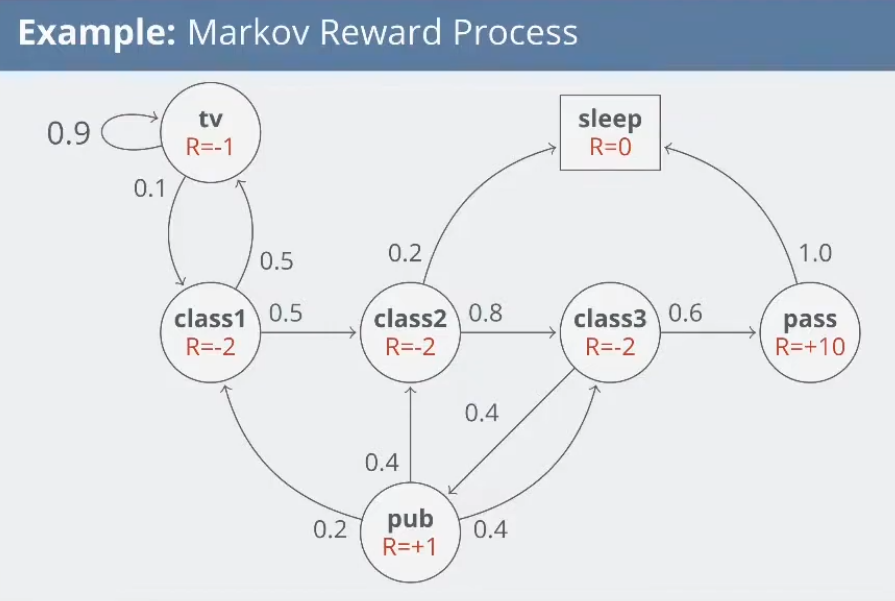
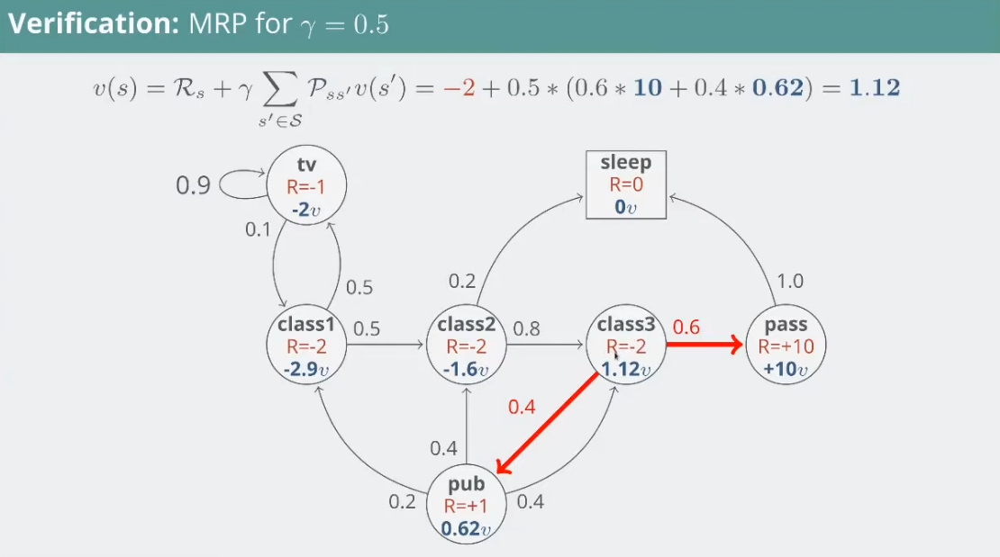
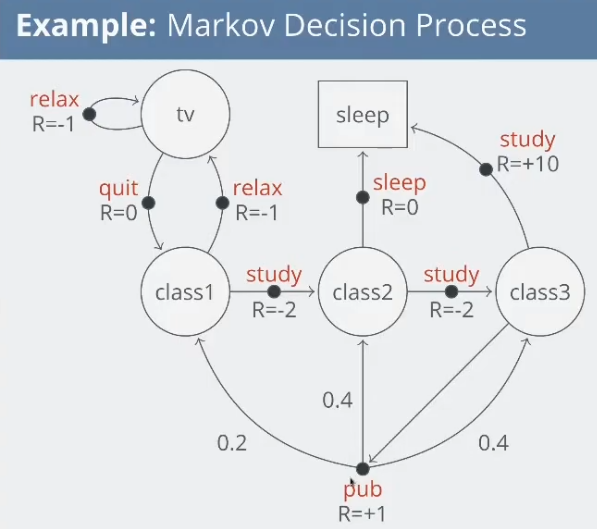
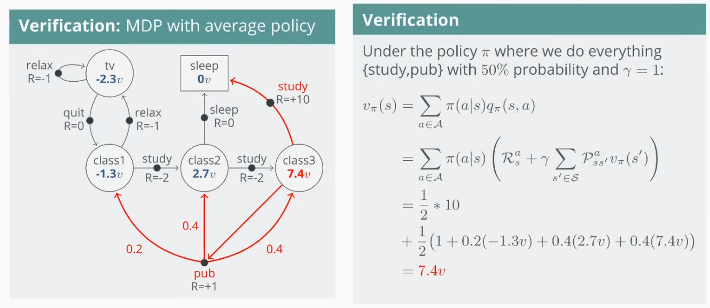
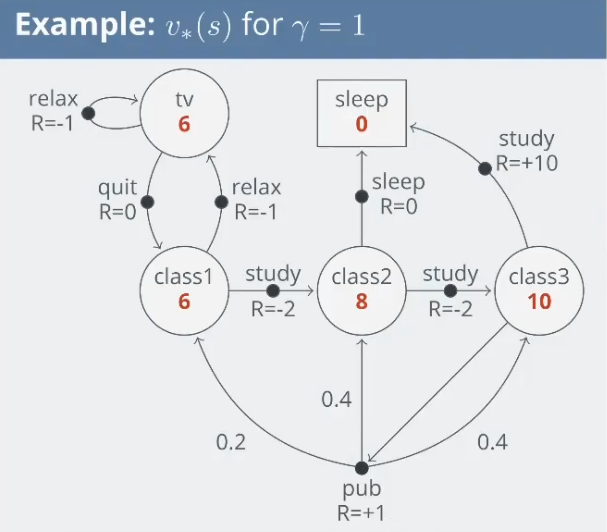
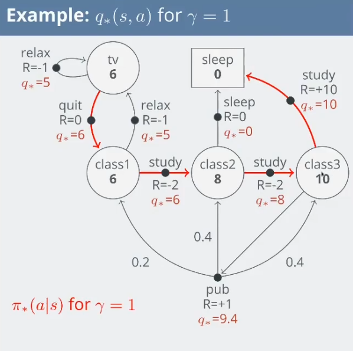

## Week 2 Notes

### Agent Types

Types of agents:

- Simple reflex agents
- Model-based reflex agents
- Goal-based agents
- Utility-based agents

### Algorithm overview

- Completeness: Does the algorithm find a solution where one exists?
- Cost optimality: Does the algorithm find the solution with the lowest path cost?
- Time complexity…
- Space complexity…
  - State space graph (explicit) measured by $|V|+|E|$ where V is graph vertices and E is edges.
  - State space graph (implicit) measured by
    - **d**: shallowest solution depth (optimal solution)
    - **m**: max solution depth
    - **b**: branch factor/the number of successors per node

**Best first search** is an umbrella term for any search that uses a priority queue ordered by an evaluation function f(n).

Let g(n) be path cost from initial to node.
Let h(n) be heuristic cost.

Uninformed algorithms: Has no heuristic function.

- BFS: uses fifo queue.
  - Optimal if all step cost = 1
  - Can use early goal test.
- DFS: uses lifo stack.
  - Not optimal
  - Can use early goal test.
- UCS: uses priority queue. f(n) = g(n)
  - Optimal when f(n) $\ge 0$.
  - Also called Dijkstra's algorithm
- IDS: uses lifo stack
  - Iterative deepening search
  - In general, is the preferred uninformed search memory when search state space is larger than can fit into memory and solution depth is not known.
  - Expand the shallower frontier all the time

DLS:              ancestor check only
Tree DFS:         ancestor check only
Graph DFS:        explored set
Tree BFS:         ancestor check only (never used)
Graph BFS:        frontier + explored sets
A* consistent:    frontier + explored sets
A* inconsistent:  reached states dict with cost comparison

Informed algorithms: Has a heuristic function.

- Greedy search: uses priority queue. f(n) = h(n)
- A*: uses priority queue. f(n) = g(n) + h(n)
  - Cannot use early goal test regardless of consistent/admissible.
- Weighted A*: f(n) = g(n) + $\epsilon$h(n)

Open loop: agent does not access percepts during execution
Closed loop: agent does access percepts during execution

A node: corresponds to a state in the state space

- Parent
- Action
- State
  When we expand a node we determine the next possible states. Nodes returned from exploring represent the frontier of the search tree.

## Week 3 Stuff

### Anatomy of A*

A* is a type of best-first search that utilises path cost g(n) and heuristic cost h(n).

Admissible heuristic: a heuristic where estimated cost is always $\le$ to true cost.
Consistent heuristic: a heuristic where estimated cost is always $\le$ to (step cost to another node n_prime + the heuristic of n_prime)

Consistency implies admissibility.

#### Admissible A*

Required datastructures:

- Priority queue
- Reached map (Node -> Cost)
  Neighbour check: not in reached or node.f_cost < reached[node].f_cost

Admissibility only guarantees any explored nodes n are cost optimal when its known path cost g(n) is no greater than the best possible completion cost still lurking on the frontier. That is,

$$
g(n)\;\le\;\min_{m\in \text{OPEN}}\bigl(g(m)+h(m)\bigr).

$$

This means that the **exit condition** for admissible A* must check if the node matches the goal state **and** the cost of the node is less than the cost of any node in the frontier. A side effect of this is that the algorithm must keep track of the best candidate solution so far.

Extra:

- Cost optimality guaranteed even if only the nodes on solution path are admissible.
- Cost optimality guaranteed even if heuristic is not admissibility but never overestimates a cost more than the difference between the optimal and second most optimal solutions.

#### Consistent A*

Required datastructures:

- Priority queue
- Reached map (Node -> Cost)
- Explored (prevent reexpansions)
  Neighbour check: not in explored and (not in reached or reached[node].f_cost < node.f_cost)

Consistency guarantees that any explored nodes n are cost optimal.

That means our **exit condition** must only check if the node matches the goal state.

In addition, it means we never need to re-expand a pre-expanded node. Therefore we can introduce an `expanded` set variable and before appending to the frontier, we can check if the node has already been expanded or not.

#### Weighted A*

$$
f(n)=g(n)+\epsilon\,h(n)

$$

for some weight $\epsilon>1$.

This will:

- Decrease runtime as search is more heavily weighted towards nodes "closer" to the goal.
- Lose admissibility and hence cost-optimality.

However, weighted A* does provide a suboptimality guarantee that the cost C of the returned solution satisfies $C \;\le\; \epsilon \,C^*$

In weighted A* we can also get rid of the $g(n)\;\le\;\min_{m\in \text{OPEN}}\bigl(g(m)+h(m)\bigr)$ check because we've given up on cost-optimality. Getting rid of the check will reduce solution quality (suboptimality still guaranteed).

#### Beam Search

An alternative form of A* where cost optimality and suboptimality are sacrificed for memory and performance. The frontier is limited to either:

- Only keeping the lowest cost k nodes.
- Only keeping nodes with costs within $\delta$ of current optimal node.

## Week 4 Stuff

### Anatomy of Local Search

**Local search** refers to a family of optimisation methods that explore a problem’s solution space by iteratively moving to "neighbour" states

Given:

- A set of states
- An evaluation function
  Find $X^*$ where $\forall X, Eval(X^*)\gt Eval(X)$

We do not care about actions taken.

#### Hill Climbing Search

**Hill climbing** refers to the general framework of moving to a better neighbour until no improvement is possible.

Incomplete as it can get stuck in local maximums.

There are several variants:

- **Greedy Local Search / Steepest Ascent Hill Climb**

Choose highest value neighbour until reached local/global maximum.

```python
def hill_climb(problem) -> state:
  current = make_node(problem.initial_state)
  while True:
    neighbour = highest_value_neighbour(current)
    if eval(neighbour) > eval(current): current = neighbour
    else: return current
```

We may allow sideway moves to escape from shoulders (and limit max number of consecutive sideway moves allowed).

- **Stochastic Hill Climb**

Choose neighbour at random from uphill moves.

- **First-choice Hill Climb**

Choose first randomly generated neighbour which is uphill. Good if node has thousands of neighbours.

- **Random-restart Hill Climb**

Perform hill-climb multiples times with random starting locations.

If $p$ is probability of success on first try. The expested number of restarts is $1/p$.

#### Simulated Annealing

For K times:
Start with high temperature T, iterate over neighbours randomly and:

- if eval(neighbour) > eval(current), accept the move
- else accept move with probability $e^{-(E-E')/T}$
  T = $\alpha \cdot T$ ($\alpha<1$)

Large differences in eval cost (E-E') reduce the likelihood of picking the downhill move.
T decreases with time to also reduce the likelihood of picking the downhill move.

### Constraint Satisfaction Problems

**State** defined by variables $X_i$ with values from domain $D_i$.
**Goal test** a set of constraints specifying allowable combinations of values for variables.

**Unary constraint**: restricts the domain of a single variable.
**Binary constraint**: restricts the allowable value combinations of a pair of variables.
**Higher order constraints**: 3 or more variables.

For $n$ variables, $d$ domain size and $l$ depth, branching factor is $b=(n-l)\cdot d$

Over n levels (ℓ=0…n–1) the total number of leaves is

$$
\prod_{\ell=0}^{n-1}\bigl((n-\ell)d\bigr) \;=\; (n\cdot(n-1)\cdots1)\,\times\,d^n \;=\; n!\,\cdot\,d^n.

$$

#### Backtracking Search

Basic uninformed algorithm for solving CSPs.

```python
def backtrack(assignments, constraints):
  if complete(assignments): return assignments
  var = select_unassigned_variable(assignments, constraints)
  for value in domain_values(var, assignments, constraints):
    if consistent(value, assignments):
      assignments.add(var, value)
      result = backtrack(assignments, constraints)
      if result != failure: return result
      assignments.remove(var, value)
  return failure
```

We can add heuristics to optimise search:

- Minimum remaining values: pick the node with the smallest domain
- Degree heuristic: pick the node with the most constraints
- Least constrained value: assign the value with the least constraints
- Forward chaining: after each assignment, immediately eliminate inconsistent values from neighbouring domains

#### Arc Consistency

A node is arc consistent iff for every value x of X, there is some allowed y.

```python
def ac3(constraints) -> constraints:
  queue = []
  while queue:
    x_i, x_j = remove_first(queue)
    if remove_inconsistent_values(x_i, x_j):
      for k in neighbours(x_i):
        queue.append(k, x_i)

# very very very rough pseudocode
def remove_inconsistent_values(x_i, x_j) -> bool:
  removed = false
  for x in domain(x_i):
    support_exists = False
    for y in domain(x_j):
      if constraint(x_i, x, x_j, y):
        support_exists = True
        break
    if not support_exists:
      domains[Xi].remove(x)
      removed = True
  return removed
```

## Week 5 Stuff

### Classification of Machine Learning

Types of machine learning:

- Supervised (examples and labels given)
  - Classification (discrete predictions)
  - Regression (continuous predictions)
- Unsupervised (only examples, no labels)
  - Clustering
  - Non-clustering
    - PCA: Linear transform that finds orthogonal directions (principal components) that maximise variance (extract the directions of greatest variance, which is very useful for feature extraction, denoising and compression)
    - ICA: Linear transform that finds components that are statistically independent. (separate mixed sources (blind source separation))
  - Association (rule) learning (wikipedia classifies this as supervised learning)
    - $X\implies Y$
    - Every rule is composed by two different sets of items, also known as itemsets, X and Y, where X is called antecedent or left-hand-side (LHS) and Y consequent or right-hand-side (RHS)
- Reinforcement learning (learn sequence of actions to maximise payoff)
  - Algorithm/agent interacts with the environment and gets a positive/negative reward
  - Common RL algorithms:
    - Temporal difference
    - Deep adversarial networks
    - Q-learning
  - Easier to work with when dealing with unlabeled data sets
  - Most ML platforms don't have reinforcement learning capabilities because they require higher computing power than most organisations have.

Trade-off between three factors (Dietterich, 2003)

- Model class complexity (hypothesis-class complexity)
- Training data size
- Generalisation error
- As training data size increases -> generalisation error decreases
- As complexity increases -> generalisation error decreases then increases

To estimate generalization error, we need data unseen during
training. We split the data as

- Training set (60-80%)
- Validation set (10-20%)
- Test (publication) set (10-20%)

## Week 6

## Week 7

## Week 8

## Week 9

## Week 10

### Markov Chains

#### Markov Property
A state $S_t$ is Markov if and only if:

$$
P(S_{t+1} \mid S_t) = P(S_{t+1} \mid S_1, S_2, \ldots, S_t)

$$

That is, the current state fully characterises the distribution over future events:

$$
H_{1:t} \rightarrow S_t \rightarrow H_{t+1:\infty}

$$

E.g., a chess board, you do not need to know the moves played up to the currenct state of the game to inform future state.

#### State transition matrix
Describes the probability of transitioning from one state to another.

The probability of transition from state $s$ to $s'$ is:

$$
P_{ss'} = P(S_{t+1} = s' \mid S_t = s)

$$

Which is canonically represented as the state transition matrix:

$$
\mathbf{P} =
\begin{bmatrix}
P_{11} & \cdots & P_{1n} \\
\vdots & \ddots & \vdots \\
P_{n1} & \cdots & P_{nn}
\end{bmatrix}

$$

The rows represent origin states and the columns represent destination states.

#### Markov Chain
(also called Markov Process) Is the set of states and a state-transition matrix: $\langle S, \mathcal{P} \rangle$ where:

- $\mathcal{S}$ is a finite set of states
- $\mathcal{P}$ is the state transition matrix where $\mathcal{P}_{ss'}=P(S_{t+1}=s' | S_t = s)$

#### Markov episode
Is a finite sequence of states generated by following the chain until termination: $S_1, S_2, \dots, S_T$

#### Markov reward process
A Markov Chain with a reward function: $\langle \mathcal{S, P, R, \gamma}\rangle$ where:

- $\mathcal{S}$ is a finite set of states
- $\mathcal{P}$ is the **state transition matrix** where $\mathcal{P}_{ss'}=P(S_{t+1}=s' | S_t = s)$
- $\mathcal{R}$ is a **reward function** where $\mathcal{R}_s=\mathbb{E}[R_{t+1}|S_t = s]$
- $\gamma$ is the **discount** rate $\gamma \in [0,1]$

Just expanding on the reward function: if you are in **state (a)** at time (t), the **reward function $R(a)$** is:

$$
R(a) = \mathbb{E}[R_{t+1} \mid S_t = a]

$$

This is the **expected immediate reward you get when leaving state (a)**. By convention, it’s said that the reward is received after the agent leaves the state, and is hence regarded as $R_{t+1}$.

For the below Markov Reward Process:

$$
R(\text{tv}) = \mathbb{E}[R_{t+1} \mid S_t = \text{tv}] = -1

$$

* $R(\text{class1}) = -2$
* $R(\text{class2}) = -2$
* $R(\text{class3}) = -2$
* $R(\text{pub}) = +1$
* $R(\text{pass}) = +10$
* $R(\text{sleep}) = 0$



#### Return
The return $G_t$, in the simplest case, is the total future reward:

$$
G_t = R_{t+1} + R_{t+2} + R_{t+3} + \dots + R_T.

$$

In practice, we discount rewards into the future by the discount rate $\gamma \in [0,1]$:

$$
G_t = R_{t+1} + \gamma R_{t+2} + \gamma^2 R_{t+3} + \dots
= \sum_{k=0}^{\infty} \gamma^k R_{t+k+1}.

$$

Remember that each $R$ is a random variable.

#### State value function
($V(s)$) The long-term value of a state:

$$
V(s) = \mathbb{E}[G_t \mid S_t = s]

$$

This may be calculated for example by sampling episodes.


#### Bellman equations
A way of decopmosing the value finction into the immediate reward $R_{t+1}$ and the discounted value of the next state $\gamma \cdot v(S_{t+1})$

$$
\begin{align}
V(s) &= \mathbb{E}\left[G_t \mid S_t = s\right] \\
 &= \mathbb{E}\left[R_{t+1} + \gamma R_{t+2} + \gamma^2 R_{t+3} + \gamma^3 R_{t+4} + \dots \mid S_t = s\right] \\
 &= \mathbb{E}\left[R_{t+1} + \gamma \left( R_{t+2} + \gamma R_{t+3} + \gamma^2 R_{t+4} + \dots \right) \mid S_t = s\right] \\
 &= \mathbb{E}[R_{t+1} + \gamma G_{t+1} \mid S_t = s] \\
 &= \mathbb{E}[R_{t+1} + \gamma v(S_{t+1}) \mid S_t = s]
\end{align}

$$

Which is equivalent to:

$$
V(s) = \mathcal{R_s} + \gamma \sum_{s'\in\mathcal{S}} \mathcal{P}_{ss'} \cdot v(s')

$$

Remember $\mathcal{P}$ is the transitional probabilities.

Which can be expressed in matrices:

$$
\begin{bmatrix}
v(1) \\
\vdots \\
v(n)
\end{bmatrix}
=
\begin{bmatrix}
R_1 \\
\vdots \\
R_n
\end{bmatrix}
+ \gamma
\begin{bmatrix}
P_{11} & \cdots & P_{1n} \\
\vdots & \ddots & \vdots \\
P_{n1} & \cdots & P_{nn}
\end{bmatrix}
\begin{bmatrix}
v(1) \\
\vdots \\
v(n)
\end{bmatrix}

$$

which is a linear equation that can be solved:

$$
\begin{aligned}
v &= R + \gamma P v \\
(I - \gamma P)v &= R \\
v &= (I - \gamma P)^{-1} R,
\end{aligned}

$$

where $I$ is the identity matrix. Unfortunately, this matrix inversion is too slow, except for small MDPs, so we use iterative methods for larger MDPs (MC evaluation and TD learning).

Verifying the bellman equation:



#### Markov Decision Process
Adds 'actions' to the Markov Reward Process so the transition probability matrix now depends on which action the agent takes.

A **Markov decision process** is a tuple $\langle \mathcal{S, A, P, R, \gamma} \rangle$:

- $\mathcal{S}$ is a finite set of states
- $\mathcal{A}$ is a finite set of actions
- $\mathcal{P}$ is the **state transition matrix** where $\mathcal{P}_{ss'}^{a}=P(S_{t+1}=s' | S_t = s, A_t = a)$
- $\mathcal{R}$ is a **reward function** where $\mathcal{R}_s^{a}=\mathbb{E}[R_{t+1}|S_t = s, A_t = a]$
- $\gamma$ is the **discount** rate $\gamma \in [0,1]$




#### Policy

A policy $\pi$ is a distribution over actions given a state:

$$
\pi(a \mid s) = P(A_t=a \mid S_t = s)
$$

#### State value function (Markov Decision Process)

The state value function $v_\pi$ is the same, but is the return when following a given policy $\pi$:

$$v_\pi = \mathbb{E}_\pi[G_t \mid S_t = s]$$

#### Action value function

The action value function is the long lerm value of a state when choosing an action with policy $\pi$:

$$
q_\pi(s, a) = \mathbb{E}_\pi[G_t \mid S_t = s, A_t = a]
$$

#### State value function (the Bellman equation)

Similarly to MRPs, the state-value function can be decomposed into the immediate reward  
and the discounted value of the next state:

$$
\begin{aligned}
v_{\pi}(s) &= \mathbb{E}_{\pi}[G_t \mid S_t = s] \\
&= \mathbb{E}_{\pi}[R_{t+1} + \gamma v_{\pi}(S_{t+1}) \mid S_t = s] \\
&= \sum_{a \in \mathcal{A}} \pi(a \mid s) q_{\pi}(s, a),
\end{aligned}
$$

which is also the case for the action-value function, where:

$$
\begin{aligned}
q_{\pi}(s, a) &= \mathbb{E}_{\pi}[G_t \mid S_t = s, A_t = a] \\
&= \mathbb{E}_{\pi}[R_{t+1} + \gamma q_{\pi}(S_{t+1}, A_{t+1}) \mid S_t = s, A_t = a] \\
&= R_s^a + \gamma \sum_{s' \in \mathcal{S}} P_{ss'}^{a} v_{\pi}(s').
\end{aligned}
$$



#### Optimal state value function
The maximum value function over all policies:

$$v_* = \max_\pi v_\pi (s)$$

#### Optimal action value function
The maximum action value function over all policies:

$$ q_* (s,a) = \max_\pi q_\pi(s,a)$$






