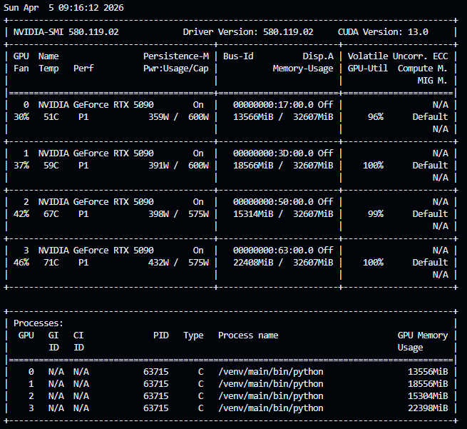

CNN PathMNIST

Test summary metrics:
  cnn-2: loss=0.77, acc=86.31%
  cnn-8: loss=0.36, acc=92.27%
  cnn-16: loss=0.64, acc=86.27%
  cnn-32: loss=0.50, acc=86.69%

cnn-2 (92%): 100% 30/30 [16:05<00:00, 30.95s/it]
cnn-32 (94%): 100% 30/30 [54:53<00:00, 107.47s/it]
cnn-8 (97%): 100% 30/30 [25:26<00:00, 49.91s/it]
cnn-16 (96%): 100% 30/30 [38:41<00:00, 75.43s/it]

```
{'cnn-2-train-loss': [1.360145167024298, 0.6254593799398704, 0.44871047024869104, 0.3393477782268416, 0.2765169100073928, 0.23161162258210508, 0.18655995294367048, 0.1580789785154841, 0.12442089446862652, 0.11593679324935445, 0.07785224944712933, 0.061417118212292815, 0.07409959992086938, 0.050405310109702194, 0.04390264199636559, 0.050819030567336915, 0.031697212437972085, 0.028864630149407523, 0.03179988684529566, 0.031789103592018364, 0.021794763020311206, 0.030670289471427994, 0.023657597058693434, 0.02542733574079069, 0.0257455016608219, 0.015491121519434355, 0.027359610512576182, 0.03076775312464716, 0.01077134242967242, 0.02497147701458082], 'cnn-2-train-acc': [0.525834834203124, 0.7692905970933762, 0.8376934101635759, 0.8781966568732803, 0.9011569729244168, 0.9174072264947675, 0.9333017324520783, 0.9434963474896821, 0.9555610160936009, 0.9593730976974423, 0.9730227780951695, 0.9786754260686311, 0.974609375, 0.9835725065998056, 0.9860193030062047, 0.9828733766282146, 0.9894464666193182, 0.9906820719215003, 0.988814237612215, 0.9894743683663282, 0.9923114727505229, 0.9895241477272727, 0.992222694341432, 0.9916104403409091, 0.9911110617897727, 0.9949526304209774, 0.9907949472015555, 0.9897701907902956, 0.9965376420454546, 0.9915771484375], 'cnn-2-val-loss': [0.9131347179412842, 0.4619185969233513, 0.3877246521413326, 0.5447439022362233, 0.3632307693362236, 0.33746903762221336, 0.25358210131525993, 0.3015077952295542, 0.290164801850915, 0.2947317330166698, 0.3159165147691965, 0.29578337650746106, 0.3159516006708145, 0.3234639886766672, 0.29589584432542326, 0.3658812489360571, 0.3251705592498183, 0.33272154703736306, 0.3673454511910677, 0.8719411239027977, 0.4185326512902975, 0.36875437684357165, 0.49903923757374286, 0.46596466228365896, 0.40929178781807424, 0.38238314613699914, 0.43014191314578054, 0.39272734597325326, 0.4618574775755405, 0.47105515003204346], 'cnn-2-val-acc': [0.6528125002980232, 0.8347460940480232, 0.8598046883940696, 0.8128320321440696, 0.8766992196440697, 0.8773632809519768, 0.9170117184519768, 0.9015039071440697, 0.9122265622019767, 0.9133984372019768, 0.9053906247019767, 0.9151562497019767, 0.9111523434519768, 0.9143749997019768, 0.9215039059519767, 0.8900585934519768, 0.9176171883940697, 0.9080468758940696, 0.9049218758940697, 0.8353906258940696, 0.9072460934519768, 0.9151562497019767, 0.8946679696440697, 0.8980664059519767, 0.9079492196440697, 0.9217187508940696, 0.9075390622019768, 0.9007031247019768, 0.9100195318460464, 0.9053906247019767], 'cnn-8-train-loss': [2.2098679332570597, 2.1203110685402695, 1.0294723365117202, 0.5965469374575398, 0.408233821476725, 0.32149222937666555, 0.26400209713557904, 0.23045418053780767, 0.19846941577270627, 0.1769267273220149, 0.15744568222329358, 0.14331297793383288, 0.13202771854544568, 0.11633982909419997, 0.11177946721330624, 0.09292276795763015, 0.09176849651637232, 0.07905663033439354, 0.0783306418558244, 0.06319162052717399, 0.07406011122723365, 0.06627359723577021, 0.04797173659211363, 0.04295066845952533, 0.036436391093461265, 0.03471190442955545, 0.034608368476752235, 0.02856827980907507, 0.027676320488601712, 0.028276022749526997], 'cnn-8-train-acc': [0.13978604405102404, 0.17107662846418945, 0.5939925553446467, 0.7839279372922399, 0.8556846717203205, 0.8886135349219496, 0.9098369648510759, 0.9213686460121111, 0.9329637404192578, 0.9393370789899067, 0.9463984502310102, 0.9518824194303968, 0.9550470525229519, 0.9603734400800683, 0.961094764653932, 0.9685562728819522, 0.9681862570684064, 0.9725972757759419, 0.97244001112201, 0.978438261049715, 0.97500348768451, 0.9767308619550683, 0.9827826957811009, 0.984924474900419, 0.9871623250232502, 0.9881702769886364, 0.9882685674185102, 0.9897036069834774, 0.990513709966432, 0.9905691964721138], 'cnn-8-val-loss': [2.1853361427783966, 1.5234771847724915, 0.7796449720859527, 0.5619579248130322, 0.34455341584980487, 0.2708227589726448, 0.22360278181731702, 0.1902968805283308, 0.2072183195501566, 0.16564490292221307, 0.1561870662495494, 0.15133445784449578, 0.14875515624880792, 0.1348386738449335, 0.17060544658452273, 0.16304963678121567, 0.12609343156218528, 0.16262636985629797, 0.14487455654889345, 0.17561191078275443, 0.15269968900829553, 0.1297091530635953, 0.1420783000998199, 0.16214514086022974, 0.12980009540915488, 0.14361357912421227, 0.1446498217061162, 0.2139371804893017, 0.15899132955819367, 0.14800900155678393], 'cnn-8-val-acc': [0.14099609376862646, 0.4266015626490116, 0.7083203122019768, 0.8029296875, 0.8793554693460465, 0.9095117196440696, 0.9252343758940696, 0.9371679693460464, 0.9297265633940697, 0.9457421883940696, 0.9476367190480233, 0.9506250008940696, 0.9482812508940697, 0.9573828130960464, 0.9439843758940697, 0.9460351571440697, 0.9600781247019767, 0.9503515630960464, 0.9562890633940697, 0.9491015627980233, 0.9518945321440697, 0.9589257821440696, 0.9603710934519768, 0.9575390622019768, 0.9641796872019768, 0.9627148434519768, 0.9590625002980232, 0.9438085943460465, 0.9589062497019768, 0.9650585934519768], 'cnn-16-train-loss': [1.6297329176555981, 0.9760723672807217, 0.6798510119657625, 0.535577357915992, 0.4437695018608462, 0.38822913533923303, 0.335471759126945, 0.3011173994534395, 0.27600552404130047, 0.2279409807683392, 0.22475746843371203, 0.1960473379585892, 0.19856038198552348, 0.16361773331564936, 0.16309220282445577, 0.13911791587121447, 0.13169790396932513, 0.11930272967385297, 0.11401565987828442, 0.10722545260796323, 0.09888884443154727, 0.0888513805905611, 0.08706568121190437, 0.08300975007957524, 0.06700653497616506, 0.05320054899096827, 0.058532842395255684, 0.0636855642607605, 0.051010279766739004, 0.047753289982210845], 'cnn-16-train-acc': [0.3666392933915962, 0.6284737724133513, 0.7524896003305912, 0.8035549411380832, 0.8387755555185404, 0.8618817217648029, 0.8808695211667906, 0.8927934125743129, 0.902233411134644, 0.9210763114758513, 0.9227171265943483, 0.9333426339382475, 0.9309031301262704, 0.9433508142828941, 0.9436796114526012, 0.951662375676361, 0.9544347986917604, 0.9589257179336115, 0.9603737570684064, 0.9632533482191238, 0.9658872134644877, 0.9689814580435102, 0.9694272525269877, 0.9709697773849423, 0.9762149959463965, 0.9811865868554874, 0.979962079023773, 0.9777708375318483, 0.9824922636828639, 0.9836203835227273], 'cnn-16-val-loss': [1.0362854555249215, 0.7927266016602517, 0.8659472405910492, 0.47706272080540657, 0.5052408680319787, 0.31364316679537296, 0.29644903652369975, 0.32179184556007384, 0.28830523416399956, 0.2257539067417383, 0.26027746237814425, 0.1762114107608795, 0.2095206344500184, 0.23707987368106842, 0.15412609484046697, 0.16819307208061218, 0.16632548123598098, 0.24306469038128853, 0.15687958761118354, 0.14632036574184895, 0.20047810524702073, 0.14975794237107037, 0.16129847317934037, 0.19940507523715495, 0.20162387024611234, 0.17846993654966353, 0.149265693500638, 0.16387040484696627, 0.1547721441835165, 0.16803201930597425], 'cnn-16-val-acc': [0.6084570318460465, 0.7095898434519767, 0.6992968752980232, 0.8268164068460464, 0.8219531252980232, 0.8885937497019768, 0.8974023446440696, 0.8851953133940696, 0.8976757809519768, 0.9247265622019768, 0.9125195309519768, 0.942578125, 0.9291015625, 0.9173632815480233, 0.94970703125, 0.9422070309519768, 0.9463085934519768, 0.9170117184519768, 0.95107421875, 0.9527539059519767, 0.9394921883940697, 0.9544140622019768, 0.9499218747019768, 0.9375195309519768, 0.9394726559519768, 0.94697265625, 0.9578320309519768, 0.9550976559519768, 0.9604687497019768, 0.9513867184519768], 'cnn-32-train-loss': [1.733743250031363, 1.1607944348996335, 0.9438657210293141, 0.8119413134726611, 0.7207442124120214, 0.6798178016800772, 0.6333641262555664, 0.5820938462222164, 0.53321123868227, 0.4790052913806655, 0.4139739876105027, 0.3778748468241908, 0.34294149262661283, 0.317708661864427, 0.287999937268482, 0.2681799221529879, 0.23582631275481122, 0.22490215515294534, 0.22731130419891665, 0.1961997925430875, 0.1781547747510062, 0.17411813130390577, 0.1732610303231261, 0.1519963605308228, 0.1472746959294785, 0.12559807687913152, 0.13852910714393313, 0.1081196335197257, 0.1054315847365863, 0.10024537402205169], 'cnn-32-train-acc': [0.3251569475131956, 0.5493306742811744, 0.6359219637445428, 0.6895105139437047, 0.726396357640624, 0.7433153028515253, 0.7612631265074015, 0.7842719536274672, 0.8046003068712625, 0.8273843343962323, 0.8523548472334038, 0.866443346677856, 0.8790920505469496, 0.8890260375020179, 0.8991743607277219, 0.9068980823186311, 0.9190680169585076, 0.9228835861113939, 0.9220436789434064, 0.932321682233702, 0.9399382356892932, 0.9411589388142932, 0.9405267096378587, 0.9482459923760458, 0.9495022068308159, 0.9567376471717249, 0.9523538960651918, 0.963911893862215, 0.9633183467455886, 0.9655061003498056], 'cnn-32-val-loss': [1.4087255358695985, 0.9480103254318237, 0.8865631848573685, 0.7516764521598815, 0.702400878071785, 0.6727060526609421, 0.607160073518753, 0.5792851872742176, 0.5656335681676865, 0.43271791785955427, 0.42374919503927233, 0.3549607276916504, 0.3679927200078964, 0.31681588664650917, 0.34694346264004705, 0.26302726194262505, 0.3330355003476143, 0.24373774006962776, 0.2853862639516592, 0.23086082711815833, 0.3260846285149455, 0.3405467703938484, 0.22945982851088048, 0.19937200900167226, 0.21058139242231846, 0.25114087127149104, 0.2120757158845663, 0.21778080184012652, 0.26449503302574157, 0.21685845255851746], 'cnn-32-val-acc': [0.46531250029802323, 0.6395898446440696, 0.6487109377980232, 0.7071875005960464, 0.7307031258940697, 0.7415820315480233, 0.7762304693460464, 0.7873828127980232, 0.79482421875, 0.8441796883940696, 0.8530664071440697, 0.8766210943460464, 0.8703515633940697, 0.8926171883940697, 0.8872656255960465, 0.9124414071440696, 0.8871484383940696, 0.9205664068460464, 0.9008203133940696, 0.9270703122019768, 0.89423828125, 0.8956445321440697, 0.9255078122019768, 0.9398632809519768, 0.9344921872019768, 0.9288281247019767, 0.9346874997019767, 0.9384960934519768, 0.9202539071440696, 0.9365429684519768]}
```

# CNN BloodMNIST

Test summary metrics:
  cnn-2: loss=0.33, acc=95.94%
  cnn-8: loss=0.53, acc=91.67%
  cnn-16: loss=0.67, acc=91.15%
  cnn-32: loss=0.27, acc=91.62%

cnn-2 (96%): 100% 50/50 [03:48<00:00,  4.44s/it]
cnn-8 (93%): 100% 50/50 [08:17<00:00,  9.67s/it]
cnn-16 (92%): 100% 50/50 [15:02<00:00, 18.25s/it]
cnn-32 (93%): 100% 50/50 [24:29<00:00, 29.45s/it]

```
{'cnn-2-train-loss': [1.3970724007981346, 0.3854342294249305, 0.29036313143962206, 0.20591237732672438, 0.14952328424641792, 0.13781427262340956, 0.11423655569722707, 0.11012116887850716, 0.09004680219450019, 0.0654742723980789, 0.077681782969179, 0.0459443871828324, 0.04886216117457591, 0.04060584179407115, 0.051269392744715224, 0.03243883991571029, 0.018084611506188876, 0.026386128123295566, 0.026858944931800726, 0.05744435665207631, 0.021967671135500234, 0.02052824726852512, 0.01127318366323934, 0.027914633135985828, 0.019612192833764395, 0.0045810843066014795, 0.00015146615186602182, 5.508039209737891e-05, 3.557374177027649e-05, 2.7365250727287053e-05], 'cnn-2-train-acc': [0.6033057850949904, 0.8581657145112593, 0.8953193362383919, 0.9257064292775118, 0.9477774060983709, 0.9513429750733197, 0.9598383565637517, 0.9591562346341138, 0.9687925376356604, 0.9768002549594736, 0.9725935825689591, 0.9837627611695764, 0.9845983226669026, 0.9858516649128919, 0.9819245258754588, 0.9892911397837063, 0.9945551772168614, 0.9906280381794281, 0.9904745986117399, 0.980113636044895, 0.9921320488746154, 0.9925635023550554, 0.9968947494093747, 0.989555480964681, 0.9935661761518468, 0.9984124328363388, 0.9999999996812586, 0.9999999996812586, 0.9999999996812586, 0.9999999996812586], 'cnn-2-val-loss': [0.41185959345764583, 0.4378663919590138, 0.2741622394985623, 0.2059953080283271, 0.23078864233361351, 0.15355583059566993, 0.1906738132238388, 0.1799636110663414, 0.15243323085208735, 0.21519402483547176, 0.15425745873815483, 0.19616829483183446, 0.15355053123224666, 0.20715560550215067, 0.18179846920624929, 0.21264973420787742, 0.22267000368554835, 0.25837307085317596, 0.249722003246899, 0.24194650226100176, 0.23104201669425325, 0.21875576211001585, 0.19313318565211915, 0.2149394824066096, 0.17318865270095152, 0.18706943858759822, 0.21174166452450058, 0.2079413728616028, 0.21190605123734307, 0.21532797437437154], 'cnn-2-val-acc': [0.8530092592592593, 0.8329475323359171, 0.8983410508544357, 0.9257330254272178, 0.9226466064099912, 0.9519675925925926, 0.9359567915951764, 0.9423225323359171, 0.9550540138173986, 0.9361496920938845, 0.9573688286322134, 0.953125, 0.9558256180198105, 0.9411651249285098, 0.9540895069086993, 0.9475308656692505, 0.9525462962962963, 0.9334490740740741, 0.9355709883901808, 0.9456018518518519, 0.9537037037037037, 0.9511959883901808, 0.9600694444444444, 0.9415509259259259, 0.9600694444444444, 0.9633487661679586, 0.9610339513531437, 0.9623842592592593, 0.9612268518518519, 0.9618055555555556], 'cnn-8-train-loss': [1.1801262513838988, 0.6123672223346118, 0.43181415125329226, 0.36709447452091276, 0.30883018365677667, 0.2568415118889375, 0.20802672474301434, 0.19070515622270298, 0.1863805505242896, 0.12342515191372065, 0.10849846748605291, 0.0975839879642674, 0.09098742367390962, 0.08129903432081409, 0.06747121314074904, 0.045564278214422854, 0.04829593320167997, 0.10373656002973969, 0.04023772097606072, 0.029684575657294265, 0.02276040994117714, 0.02358627051798587, 0.05210679441716592, 0.03842026034412398, 0.00762452462686999, 0.009291816345092444, 0.024518941281012254, 0.02891724377688155, 0.019102343504552425, 0.026457456713041196], 'cnn-8-train-acc': [0.5552214996062498, 0.7736904471315802, 0.8380286824256978, 0.8659637822186883, 0.8887882838274705, 0.9049981768755989, 0.9255393169780466, 0.9298143533461871, 0.9346043993445003, 0.9565097836249652, 0.961328694527162, 0.9641969494003663, 0.965129739779202, 0.9699623237319172, 0.9760345768801031, 0.9847654349663678, 0.9817012028898148, 0.9638065141152571, 0.986046122675911, 0.989792476682102, 0.9918950531571944, 0.9914772724085313, 0.9818546424575031, 0.9867981280235045, 0.9980782082374083, 0.9970755344406169, 0.9925635023550554, 0.9899595889815672, 0.9932319515529163, 0.9913800435270218], 'cnn-8-val-loss': [0.7604153487417433, 0.4741434543221085, 0.388915028836992, 0.39542352932470815, 0.33230267741062025, 0.2960311786995994, 0.36596856735370775, 0.2505205334336669, 0.31674965029513397, 0.2917263259490331, 0.2866195510658953, 0.2947540270785491, 0.3126219075035166, 0.29186893971981825, 0.2593994841531471, 0.3232707861397002, 0.34444208332785853, 0.3023465402700283, 0.3946373871079198, 0.4133965168838148, 0.4855210472036291, 0.5399075716182038, 0.32583601448546956, 0.3091879287665641, 0.40443339164334313, 0.41225516940122126, 0.3723818617010558, 0.32489805585808224, 0.3679575653125842, 0.3421516680607089], 'cnn-8-val-acc': [0.6984953703703703, 0.8138503101136949, 0.8489583333333334, 0.8570601851851852, 0.8713348772790697, 0.8985339513531437, 0.8709490740740741, 0.9110725323359171, 0.8989197545581393, 0.9108796296296297, 0.9137731481481481, 0.9214891990025839, 0.9139660508544357, 0.9222608032049956, 0.9284336434470283, 0.9122299397433246, 0.91358024764944, 0.9180169767803616, 0.9021990740740741, 0.9027777777777778, 0.911844136538329, 0.8998842592592593, 0.9257330254272178, 0.9238040138173986, 0.9315200624642549, 0.9207175925925926, 0.9263117291309215, 0.9268904328346252, 0.9185956804840653, 0.9324845693729542], 'cnn-16-train-loss': [1.2275489979886753, 0.6549716457963627, 0.49389020548784796, 0.3960360441615875, 0.33303968257763805, 0.25496565279635514, 0.19878084969552443, 0.16917612966409024, 0.15104118593156657, 0.12100968654342195, 0.12271552723658116, 0.0833903440837076, 0.0733489637377667, 0.07485520642220894, 0.0637329950839042, 0.038007756550721625, 0.03798006734509459, 0.04826378382998892, 0.03748101746242613, 0.03880704227644442, 0.01897282846171451, 0.03320853368495591, 0.0360210391833356, 0.019069488088603138, 0.03319781785099369, 0.012702817255232467, 0.016996990501467277, 0.04032718723255115, 0.017910507207401446, 0.03712792480647698], 'cnn-16-train-acc': [0.5390389523404168, 0.7568683152530282, 0.817835439972699, 0.8563138064853648, 0.879680663506615, 0.9105539012720241, 0.9303156902445829, 0.9380302014835378, 0.9469570367731512, 0.9579439109021967, 0.9562727879075443, 0.9697116552827193, 0.9738469248149484, 0.9737633686652158, 0.977676834970872, 0.9863803472748415, 0.9868406659779064, 0.9840833130367299, 0.986700899141995, 0.9864639034245741, 0.994207279886154, 0.9882185825689591, 0.9885254617043358, 0.9936223868380256, 0.989137700216018, 0.9961427440617812, 0.9943607194538422, 0.9862967911251088, 0.9946524060983709, 0.9879679141197613], 'cnn-16-val-loss': [0.8244643961941754, 0.4765752377333464, 0.40759022920219984, 0.41021600476017706, 0.4004257056448195, 0.32648750642935437, 0.29396918443618, 0.26651027191568305, 0.2922289790930571, 0.2973887362965831, 0.3558307695719931, 0.36659090952188883, 0.3334008195885905, 0.39743510274975385, 0.37073962914722935, 0.40612459072360285, 0.44027245541413623, 0.40180076548346766, 0.4041430451389816, 0.38174740970134735, 0.5164856114597233, 0.4712888650872089, 0.4736362723288713, 0.47622452124401377, 0.4280914658749545, 0.561045965662709, 0.6640474332703484, 0.4579906401534875, 0.4950046983582002, 0.5144026776154836], 'cnn-16-val-acc': [0.6921296296296297, 0.8207947545581393, 0.8479938286322134, 0.8312114212248061, 0.8551311735753659, 0.8908179027062876, 0.9010416666666666, 0.9085648148148148, 0.8971836434470283, 0.9139660508544357, 0.8848379629629629, 0.9070216064099912, 0.907793210612403, 0.9054783957975882, 0.9020061735753659, 0.9104938286322134, 0.9124228402420327, 0.9199459883901808, 0.9216820995012919, 0.9174382730766579, 0.8940972222222222, 0.9008487661679586, 0.9012345693729542, 0.9012345693729542, 0.907793210612403, 0.9037422846864771, 0.9016203703703703, 0.8954475323359171, 0.911844136538329, 0.890625], 'cnn-32-train-loss': [2.0368774122095363, 1.990229799785716, 1.4171875766254365, 0.9626956068895718, 0.88226987174488, 0.7790033963912311, 0.75765343671814, 0.659676870879005, 0.5543962827022063, 0.5430733486611575, 0.5124107997685192, 0.5524805577840397, 0.5629553157378008, 0.5316967287643708, 0.5019982951210145, 0.43149178662402105, 0.4424055294397681, 0.37624743062863375, 0.3326348638869224, 0.3310360238354474, 0.30105654927179776, 0.27762674105996116, 0.2852035770441759, 0.2730852406930159, 0.25845189037966854, 0.23483810290933294, 0.2192939059699283, 0.22882705592216654, 0.2093065102749011, 0.2022005218793364], 'cnn-32-train-acc': [0.1776099902263937, 0.20423553716690146, 0.4427701142382494, 0.6161749512754022, 0.66196220220729, 0.7034637819636952, 0.7141301045443285, 0.7517713901193385, 0.8007778318170558, 0.8047186435862659, 0.818698346933579, 0.7978822311615561, 0.7964450656411483, 0.8060130043463274, 0.8170712810149168, 0.8454241612378288, 0.8394202720672689, 0.863095527345484, 0.8799601968596963, 0.8801531355011272, 0.8899018592375485, 0.9000121533551956, 0.8951385512071497, 0.8983972410467219, 0.9045378584912754, 0.9122128706564878, 0.9212779533416829, 0.9158604763408396, 0.9227120806189144, 0.9254831062918678], 'cnn-32-val-loss': [2.0108543148747198, 1.914733679206283, 1.0033019692809493, 0.8150788082016839, 0.8118592964278327, 0.7752812637223138, 0.8129743094797488, 0.5603511499034034, 0.7273232164206328, 0.5279931061797671, 0.41403216068391446, 0.4397077869485926, 0.5262558493349287, 0.46851851432411756, 0.4734434993178756, 0.6024432226463601, 0.4668425376768465, 0.40312433463555797, 0.3303040282593833, 0.3281220319094481, 0.31626121092725684, 0.25903053719688346, 0.27110244802854677, 0.2779244264518773, 0.32529135876231724, 0.27636774436191275, 0.2838683829263405, 0.24868517127577905, 0.24285829094824968, 0.30444095587288894], 'cnn-32-val-acc': [0.19502314814814814, 0.27507716086175704, 0.5858410508544357, 0.6695601851851852, 0.6695601851851852, 0.7029320995012919, 0.6728395069086993, 0.7926311735753659, 0.739969136538329, 0.8007330254272178, 0.8559027777777778, 0.8379629629629629, 0.805748458261843, 0.8263888888888888, 0.8252314814814815, 0.7739197545581393, 0.8306327175211023, 0.856674384187769, 0.8815586434470283, 0.8846450624642549, 0.8885030878914727, 0.90625, 0.9064429027062876, 0.8985339513531437, 0.8942901249285098, 0.9043209883901808, 0.9006558656692505, 0.9178240740740741, 0.9265046296296297, 0.8966049397433246]}```

CNN BloodMNIST Improvement

Test summary metrics:
  cnn-16: loss=0.65, acc=88.92%
  cnn-32: loss=0.57, acc=86.53%
  cnn-16-d-0.5-s-2: loss=0.17, acc=95.13%
  cnn-32-d-0.5-s-2: loss=0.19, acc=95.24%

cnn-16 (90%): 100% 30/30 [10:00<00:00, 19.34s/it]
cnn-32 (88%): 100% 30/30 [15:31<00:00, 31.10s/it]
cnn-16-d-0.5-s-2 (96%): 100% 30/30 [10:46<00:00, 21.52s/it]
cnn-32-d-0.5-s-2 (96%): 100% 30/30 [17:49<00:00, 36.48s/it]

```
{'cnn-16-train-loss': [1.2372568421822818, 0.6701305454427545, 0.5109129270767783, 0.4414873062608076, 0.36220868449797605, 0.29917201128872956, 0.2593483887812033, 0.2304429373240726, 0.18367010990486426, 0.16372867469441763, 0.14001291217332218, 0.10717028739020468, 0.09122847191451545, 0.07853374884707882, 0.09592421256742853, 0.06179150920311477, 0.04415501984655558, 0.043562268877506534, 0.034707971568403634, 0.06464298555121961, 0.03765692448468859, 0.04068443304946258, 0.03008767800096841, 0.04381755282504753, 0.016509647033458082, 0.008506850518958884, 0.047558970167963045, 0.03461642514006608, 0.02435415476046373, 0.017533323634322483], 'cnn-16-train-acc': [0.5398881865695199, 0.7497235048900951, 0.8111813320195611, 0.8345314777471164, 0.8632899854272444, 0.8881335073613865, 0.9033695915166069, 0.9150659333575856, 0.9330031597678037, 0.9383218884468079, 0.9513991854407571, 0.9629299341038586, 0.9678597469380833, 0.9712430114414603, 0.9673021996722502, 0.9784850510046443, 0.9859625665261784, 0.9854612296277826, 0.9874665772213655, 0.9782617280190004, 0.9863803472748415, 0.9856982253452036, 0.9896390371144137, 0.98537767347805, 0.9949866306973013, 0.9971317451267956, 0.9839435462008186, 0.9877035729387865, 0.9916443847079965, 0.9944017376491731], 'cnn-16-val-loss': [0.7938665394429807, 0.5482825007703569, 0.5186070082364259, 0.4200455684352804, 0.420107603625015, 0.3817290851363429, 0.3716242225081832, 0.3872722597033889, 0.5229238095106902, 0.3950092980155238, 0.5115679060971295, 0.4391013781229655, 0.5097655676029347, 0.4319001441752469, 0.4169621169567108, 0.49121804921715345, 0.4606815394428041, 0.5413271072838042, 0.5395243556963073, 0.46760211498649035, 0.5603381969310619, 0.559161637392309, 0.5780786938137479, 0.557011424391358, 0.5425922638840146, 0.6996105633400105, 0.6921063705726906, 0.5308926999568939, 0.636541341189985, 0.6628490145559665], 'cnn-16-val-acc': [0.6975308656692505, 0.7854938286322134, 0.8092206804840653, 0.8387345693729542, 0.8443287037037037, 0.8620756180198105, 0.8651620370370371, 0.8674768518518519, 0.8435570995012919, 0.8800154328346252, 0.8545524698716623, 0.8840663587605512, 0.8616898148148148, 0.8836805555555556, 0.9010416666666666, 0.8859953703703703, 0.8915895069086993, 0.8767361111111112, 0.8883101851851852, 0.8798225323359171, 0.8811728402420327, 0.8900462962962963, 0.8894675925925926, 0.8842592592592593, 0.8869598772790697, 0.882137347150732, 0.8798225323359171, 0.8844521619655468, 0.880594136538329, 0.8829089513531437], 'cnn-32-train-loss': [1.5176108457187918, 1.057179619284237, 0.7208684902777647, 0.6210185802556614, 0.5846806163775092, 0.5375794988265012, 0.48233481891014995, 0.4548024547928795, 0.41312477845240403, 0.4082949987866662, 0.37326950775110784, 0.35305995537954216, 0.3238996774117577, 0.3184385463037593, 0.27069331215505293, 0.25196429718544777, 0.22245490443419647, 0.232797430758489, 0.21182749085725947, 0.19942539563791, 0.19505585620508475, 0.1668578769394102, 0.1509754606945948, 0.15465598804427977, 0.13808003754260387, 0.12832664528034907, 0.11404598028682929, 0.08015400933271105, 0.09368252309467544, 0.09295740580176287], 'cnn-32-train-acc': [0.40351391587665375, 0.6021937284877593, 0.7354080578222632, 0.7672019323563193, 0.7855979580292727, 0.8003873965319466, 0.8237831184570802, 0.8347274549504652, 0.8492388792216459, 0.8487238695914733, 0.8628023212606256, 0.8704621412537314, 0.8828831426600084, 0.8843886727955252, 0.9002628218043934, 0.9097472046785814, 0.9191465116439657, 0.9151646813606833, 0.9225449683194492, 0.9300088111092063, 0.9288678899168331, 0.9401737964727024, 0.9451324742108105, 0.9443379312275565, 0.949213052815932, 0.9530140980679721, 0.9566070125064748, 0.9705745622435993, 0.9674693119717154, 0.9650461836294695], 'cnn-32-val-loss': [1.4099072173789695, 0.879627647223296, 0.6610617174042596, 0.5434144326934108, 0.5194615302262483, 0.6031237973107232, 0.4989024190991013, 0.448614204371417, 0.4874747461742825, 0.42047359490836106, 0.4473177989323934, 0.45475618375672233, 0.40221601835003606, 0.3855207810799281, 0.386624433376171, 0.37670988451551507, 0.4321556047157005, 0.383106611945011, 0.3920801596509086, 0.4440189594471896, 0.40449763282581613, 0.45340056386258865, 0.4577755779027939, 0.48419538968139225, 0.4242425643735462, 0.5658239004788576, 0.4747610633020048, 0.5429277585612403, 0.5650660737797066, 0.5447255063939977], 'cnn-32-val-acc': [0.42669753123212745, 0.6828703703703703, 0.7490354952988801, 0.7787422846864771, 0.7991898148148148, 0.7771990740740741, 0.8146219143161068, 0.8319830254272178, 0.8119212962962963, 0.849344136538329, 0.8312114212248061, 0.8396990740740741, 0.8599537037037037, 0.8586033957975882, 0.8695987661679586, 0.8709490740740741, 0.8607253101136949, 0.8742283957975882, 0.8794367291309215, 0.859375, 0.8767361111111112, 0.866512347150732, 0.8711419767803616, 0.8580246920938845, 0.8825231481481481, 0.8591820995012919, 0.8626543217235141, 0.8618827175211023, 0.849344136538329, 0.8690200624642549], 'cnn-16-d-0.5-s-2-train-loss': [1.540741224977422, 1.1433363145685451, 0.8817199143496427, 0.6890074696770326, 0.5896165310380294, 0.5495690829294888, 0.49923044921242615, 0.4569245067669109, 0.4156266953696542, 0.397512299730816, 0.3515164777636528, 0.31292269709594744, 0.2901402707485592, 0.26050710869345434, 0.2577064772818815, 0.2362895769311145, 0.2150106729272215, 0.20543110577817908, 0.18220978433435614, 0.1936259258159979, 0.19320391493047623, 0.17482635791209292, 0.13964224042978515, 0.14777235150895016, 0.14277777503578262, 0.14118323582697678, 0.1594462666042986, 0.1461331553079865, 0.1253360953421038, 0.12434599069470072], 'cnn-16-d-0.5-s-2-train-acc': [0.4142486022755424, 0.5503190325543205, 0.6645539619705894, 0.7390845284104984, 0.7753615701262326, 0.8004557608283139, 0.8232665897053193, 0.841161278479877, 0.8532207095049282, 0.863095527345484, 0.8836488210581204, 0.8934811009442742, 0.9011545939878984, 0.9126017865012673, 0.9135209041483262, 0.9211655322880669, 0.9300513490636081, 0.9357878584912754, 0.9406751333710982, 0.9391999875797945, 0.9391164314300618, 0.9451461472613288, 0.9556742221276391, 0.9529031961359442, 0.9541140007462731, 0.9550057729297781, 0.950159516245286, 0.9555769929273881, 0.961746475275825, 0.9625668446010447], 'cnn-16-d-0.5-s-2-val-loss': [1.1729911389174286, 0.7737616808326157, 0.5727911955780454, 0.505171149969101, 0.4223316422215215, 0.4313165236402441, 0.37384906466360446, 0.3370256225268046, 0.36696690210589655, 0.3154662582609389, 0.29869233458130445, 0.24607486526171365, 0.31174073064768754, 0.24189437843031353, 0.26242586418434427, 0.2198610485151962, 0.18971061292621824, 0.18379561409906106, 0.1669241543169375, 0.17907386107577217, 0.17472484431884908, 0.22312865806398569, 0.14309202244988195, 0.17512118540428304, 0.1517653285905167, 0.20082795785533059, 0.14512337275125362, 0.15096102027153527, 0.16803732183244494, 0.14986711754291146], 'cnn-16-d-0.5-s-2-val-acc': [0.5599922846864771, 0.6871141990025839, 0.765625, 0.8132716064099912, 0.849344136538329, 0.8371913587605512, 0.8792438286322134, 0.8983410508544357, 0.8495370370370371, 0.9048996920938845, 0.9072145069086993, 0.9319058656692505, 0.9020061735753659, 0.9195601851851852, 0.9201388888888888, 0.9373070995012919, 0.9473379629629629, 0.9529320995012919, 0.9515817915951764, 0.9459876550568475, 0.9454089513531437, 0.9243827175211023, 0.9558256180198105, 0.9481095693729542, 0.9537037037037037, 0.9355709883901808, 0.954668210612403, 0.9567901249285098, 0.9533179027062876, 0.9510030878914727], 'cnn-32-d-0.5-s-2-train-loss': [1.402606867532679, 0.8316962894271401, 0.6720945328314674, 0.6157416750721753, 0.5469290294589844, 0.5426752682835023, 0.4947666200724515, 0.4465078101119893, 0.4146754934507258, 0.3709293344122841, 0.3431793579602624, 0.3315408592396241, 0.28099301612791533, 0.32344881401342507, 0.28360552253092036, 0.2655989746837055, 0.2488338674373805, 0.21771473473406092, 0.23000096075515697, 0.25933391206404743, 0.2145735978243504, 0.17961924138633326, 0.20913628502724005, 0.18767797427979063, 0.16900332678946103, 0.15566813983620806, 0.15808373879900273, 0.13530860443345524, 0.17360704407135752, 0.16138570377214706], 'cnn-32-d-0.5-s-2-train-acc': [0.48905870174979144, 0.6988256560927406, 0.7468294236749251, 0.7708510571622593, 0.7916124816884331, 0.8015571826282032, 0.8203421244646776, 0.8408285730025348, 0.8540988089566562, 0.8732741854407571, 0.8825489180610779, 0.8866705151802716, 0.9068227394379397, 0.8918935340993545, 0.9075185340993545, 0.9163770050926004, 0.9173918324995806, 0.9296609137784988, 0.9247174282124974, 0.9177685950529129, 0.9295621654566597, 0.9410655686562074, 0.934687955494233, 0.9384479822322009, 0.9489623843667342, 0.9512594189235871, 0.9504937408442166, 0.9566768959244305, 0.9469008264057139, 0.9489061739992968], 'cnn-32-d-0.5-s-2-val-loss': [0.8105859403257016, 0.572970551473123, 0.4991019809687579, 0.5293887334841268, 0.5340296868924741, 0.4847637448045943, 0.3815328931366956, 0.4231524478506159, 0.3024219191736645, 0.3412361360258526, 0.26203938601193605, 0.203543852324839, 0.23837678024062403, 0.2272202460854142, 0.19796228105271305, 0.21788429330896447, 0.20979720409269687, 0.23709579557180405, 0.20887645885900216, 0.28423978277930506, 0.17933114004079942, 0.21078617870807648, 0.18774457579409634, 0.17158056988760276, 0.1505725720414409, 0.18333634485801062, 0.13905614090186577, 0.14440799463126394, 0.19810482114553452, 0.14330318080330337], 'cnn-32-d-0.5-s-2-val-acc': [0.7247299397433246, 0.7770061735753659, 0.8020833333333334, 0.8016975323359171, 0.8161651249285098, 0.8209876550568475, 0.845293210612403, 0.8344907407407407, 0.896219136538329, 0.8798225323359171, 0.9126157407407407, 0.92920524764944, 0.9195601851851852, 0.9309413587605512, 0.9276620370370371, 0.9319058656692505, 0.9330632730766579, 0.9249614212248061, 0.929012347150732, 0.8952546296296297, 0.9461805555555556, 0.9340277777777778, 0.9438657407407407, 0.9542824074074074, 0.954668210612403, 0.939043210612403, 0.9529320995012919, 0.9556327175211023, 0.9456018518518519, 0.9560185185185185]}
```