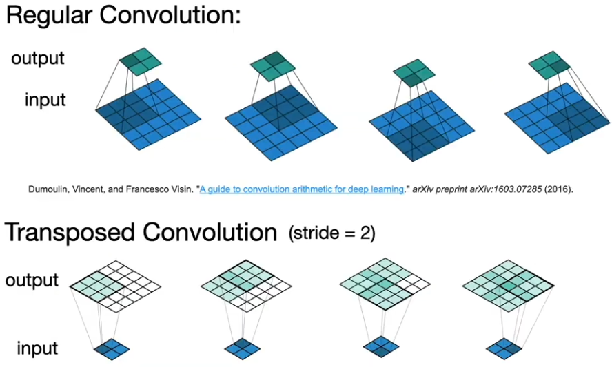
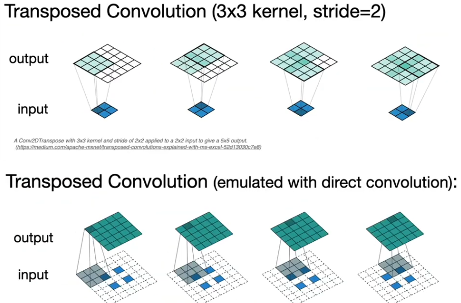
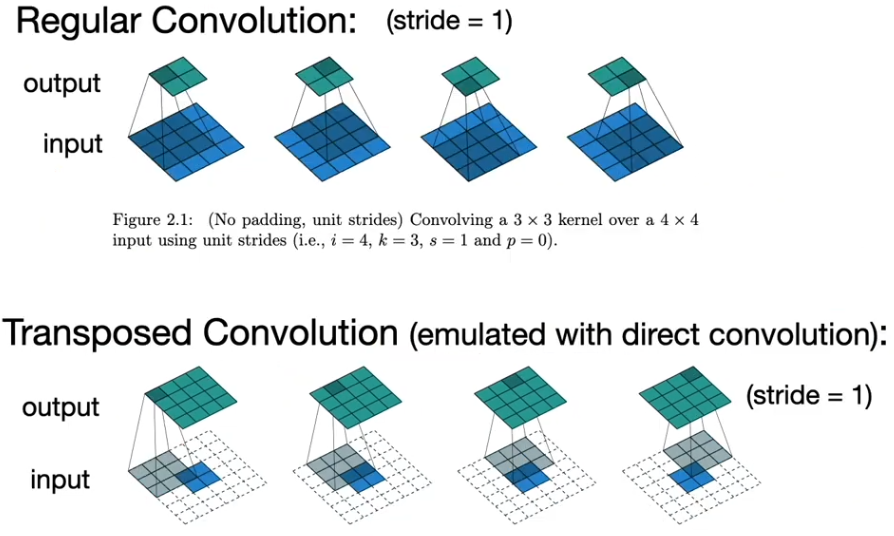
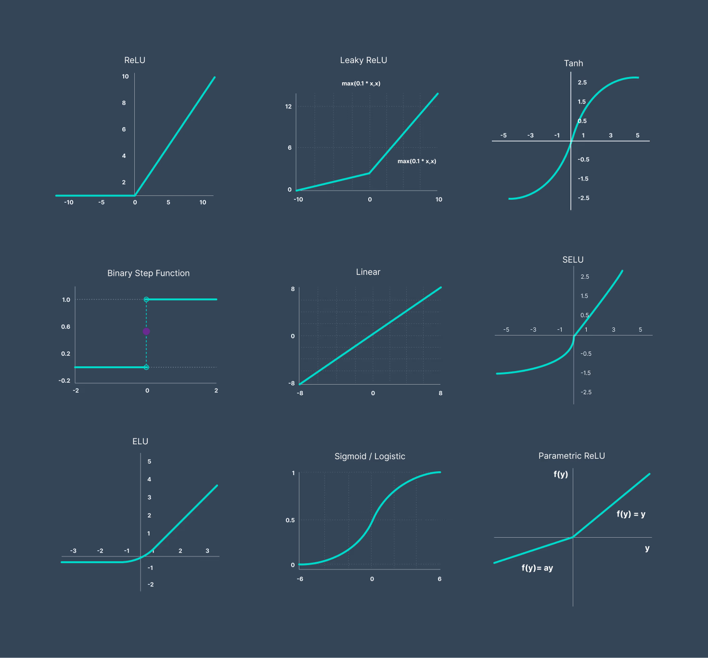
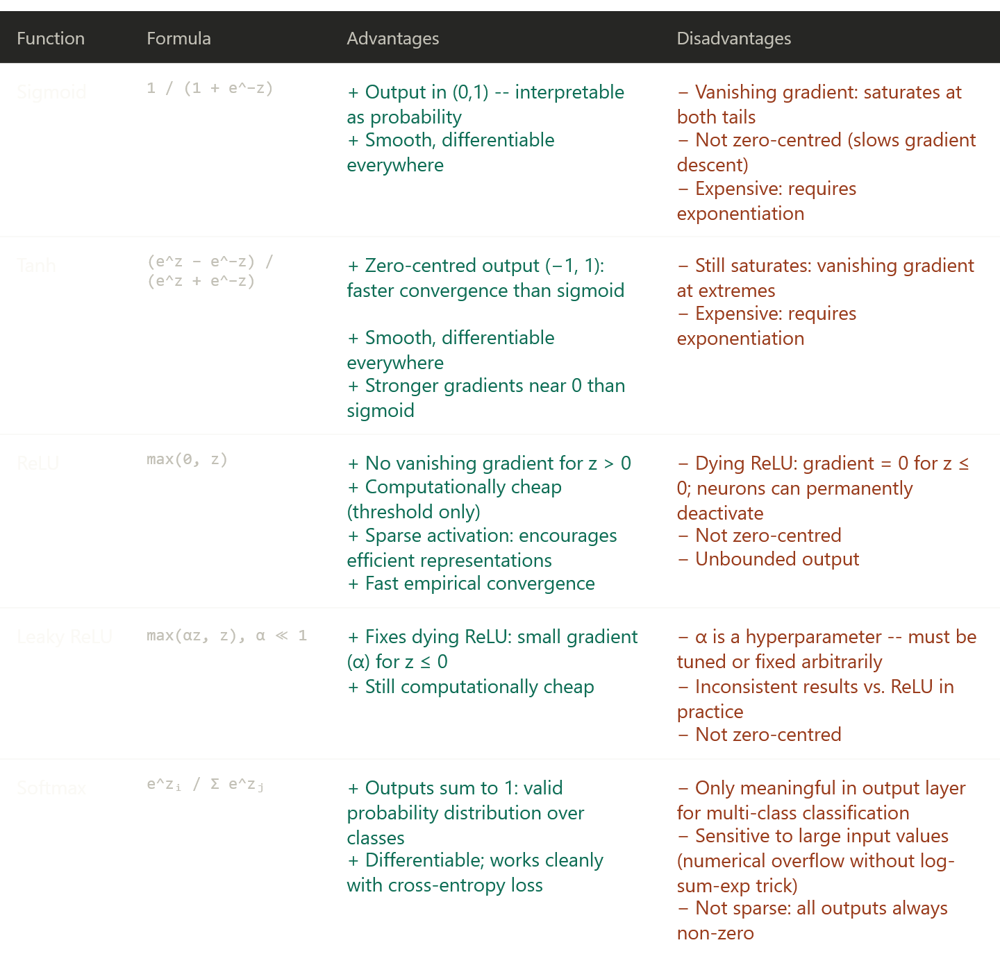
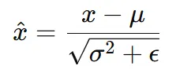
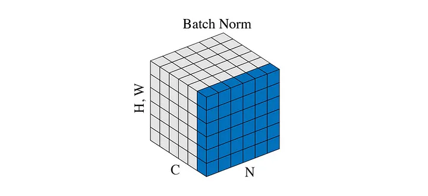
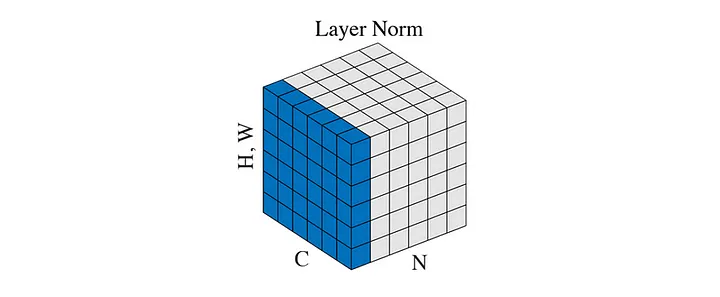
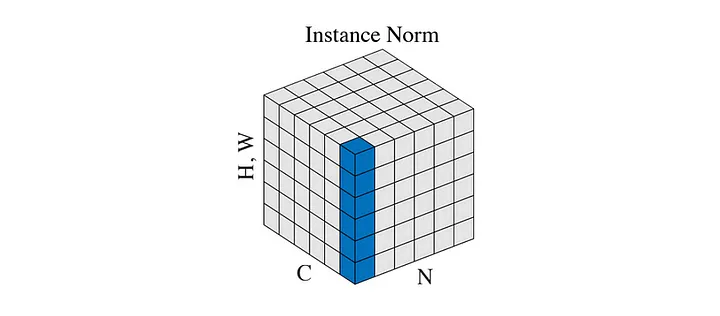
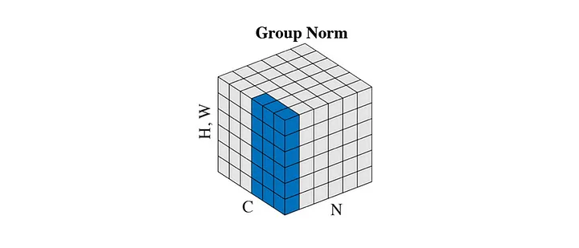

- [Flavours of gradient descent:](#flavours-of-gradient-descent)
- [Key terminology:](#key-terminology)
  - [Update equation](#update-equation)
- [Simple Models](#simple-models)
  - [Linear regression](#linear-regression)
  - [Ridge Regression / Tikhonov Regression](#ridge-regression--tikhonov-regression)
  - [Lasso Regression](#lasso-regression)
  - [Logistic Regression](#logistic-regression)
  - [Classification](#classification)
- [Complex Models](#complex-models)
  - [Convolutional](#convolutional)
    - [`nnx.Conv`](#nnxconv)
    - [`nnx.max_pool` / `nnx.avg_pool` / `nnx.min_pool`](#nnxmax_pool--nnxavg_pool--nnxmin_pool)
- [Activation Functions](#activation-functions)
- [Vanishing Gradients](#vanishing-gradients)
  - [Normalisation](#normalisation)
    - [Batch Norm](#batch-norm)
    - [Layer Norm](#layer-norm)
    - [Instance Normalisation](#instance-normalisation)
    - [Group Normalisation](#group-normalisation)
- [Types of error](#types-of-error)
- [Regularisation Methods](#regularisation-methods)
  - [Constrained Optimisation (Squared Norm Regularisatiion as Hard Constraint)](#constrained-optimisation-squared-norm-regularisatiion-as-hard-constraint)
  - [L2 Regularisation / Weight decay / Ridge regression / Tikhonov regularisation](#l2-regularisation--weight-decay--ridge-regression--tikhonov-regularisation)
  - [Dropout](#dropout)
- [VC dimension](#vc-dimension)
- [Perceptrons](#perceptrons)
  - [Analytic solution to linear regression](#analytic-solution-to-linear-regression)


## Flavours of gradient descent:
- Batch gradient descent = uses whole batch per update
- Stochastic gradient descent = uses one random sample per update
- Minibatch gradient descent = uses subset of batch per update

## Key terminology:
A **logit** is raw, unnormalized output of neural network (pre Sigmoid or Softmax).

A **probability** is post activation function (post Sigmoid or Softmax).

### Update equation
$$w_{t} \leftarrow w_{t-1} - \eta \cdot \frac{\partial \mathcal{L}}{\partial w_{t-1}}$$

---

## Simple Models

### Linear regression

Loss functions:
- L1 loss (Manhattan loss)
    - $\mathcal{l} = |\hat{y}-y|$
    - $\mathcal{L} = \frac{1}{n}\sum_i^n|\hat{y}_i-y_i|$ (mean absolute error)
    - Pytorch (logits) `torch.nn.L1Loss`
    - Optax (logits) `N/A`
- L2 loss:
    - $\mathcal{l} = (\hat{y}-y)^2$
    - Optax (logits) `optax.l2_loss` or `optax.squared_error` (does not halve)
    - $\mathcal{L} = \frac{1}{n}\sum_i^n(\hat{y}_i-y_i)^2$ (mean squared error)
    - Pytorch (logits) `torch.nn.MSELoss` (note takes average)

Note:
- **L1 norm** (Manhattan distance): $\|\mathbf{w}\|_1 = \sum_k |w_k|$
- **L2 norm** (Straight line distance): $\|\mathbf{w}\|_2 = \sqrt{\sum_k w_k^2}$
- **L2 norm squared**: $\|\mathbf{w}\|_2^2 = \sum_k w_k^2$ 

### Ridge Regression / Tikhonov Regression

- Add $\frac{\lambda}{2}||\mathbf w||_2^2$ as error term to **linear regression**


### Lasso Regression

- Add $\lambda||\mathbf w||_1$ as error term to **linear regression**

---

### Logistic Regression


Loss functions:
- Pytorch (logits) `torch.nn.BCEWithLogitsLoss`
- Pytorch (probabilities) `torch.nn.BCELoss`
- Optax (logits) `optax.sigmoid_binary_cross_entropy`
- Optax (probabilities) `N/A`

Sigmoid/Logistic function:

$$
\begin{align*}
P(\text{Class } 1) &= \frac{e^{z_1}}{e^{z_1} + e^{z_2}} = \frac{\frac{e^{z_1}}{e^{z_1}}}{\frac{e^{z_1}}{e^{z_1}} + \frac{e^{z_2}}{e^{z_1}}} \\[10pt]
&= \frac{1}{1 + e^{z_2 - z_1}} = \frac{1}{1 + e^{-(z_1 - z_2)}}
\end{align*}
$$

By defining the difference between the logits as $z = z_1 - z_2$ we get:
$$
P(\text{Class } 1) = \frac{1}{1 + e^{-z}}
$$
The model will attempt to estimate the difference $z_1 - z_2$ directly (one output, $z$)

Binary cross-entropy loss: (Pytorch `BCELoss`)
$$l(y, \hat{y}) = - \left[ y \log(\hat{y}) + (1 - y) \log(1 - \hat{y}) \right]$$

---

### Classification
Loss functions:
- Pytorch (logits) `torch.nn.CrossEntropyLoss`
- Pytorch (probabilities) `torch.nn.NLLLoss`
- Optax (logits) `optax.softmax_cross_entropy` (also `optax.softmax_cross_entropy_with_integer_labels`)
- Optax (probabilities) `N/A`


Softmax:
$$\sigma(\mathbf{z})_i = \frac{e^{z_i}}{\sum_{j=1}^K e^{z_j}}$$

Cross-entropy loss: ($\hat y$ is output after softmax output)
$$
l(\mathbf{y}, \hat{\mathbf{y}}) = - \sum_{j=1}^q y_j \log \hat{y}_j.
$$

To actually implement we use: (o is output from nn)
$$\bar{o} \stackrel{\textrm{def}}{=} \max_k o_k$$
$$
\log \hat{y}_j =
\log \frac{\exp(o_j - \bar{o})}{\sum_k \exp (o_k - \bar{o})} =
o_j - \bar{o} - \log \sum_k \exp (o_k - \bar{o})
$$

Also note that if our labels are one-hot we don't need to sum over all the outputs: $l(\mathbf{y}, \hat{\mathbf{y}}) = - \sum_{j=1}^q y_j \log \hat{y}_j$ turns into $l(\mathbf{y}, \hat{\mathbf{y}}) = - y_c \log \hat{y}_c = -\log \hat{y}_c$. (c stands for correct class)

Overall:
$$l = - \left( o_c - \bar{o} - \log \sum_k \exp(o_k - \bar{o}) \right)$$

## Complex Models

### Convolutional

MLP suffers 2 problems:

1. Translation invariance: In an MLP weights are tied to specific pixel indices, so if a feature in the input moved, it would no longer be detected.

2. Locality: In an MLP, a neuron is influenced by every single pixel in the image equally, however meaningful visual features are usually defined by small neighbourhoods of pixels close together.


---
Transposed convolution
- Other names: unconv or fractionally strided convolution
- Sometimes (incorrectly) called "deconvolution"

Transposed conv = input dilation by $(s - 1)$ and border padding of $(k - 1 - p_{\text{per side}})$, then standard conv with stride 1.

Output shape:
$$(s(n_h-1) + k - p_{\text{h total}}) \times (s(n_w-1) + k - p_{\text{w total}})$$






---

Mathematical operations:

1. Convolution ($f\ast g$)

    $$(f * g)(t) = \int f(\tau) \, g(t - \tau) \, d\tau$$

2. Cross-correlation ($f\star g$)

    $$(f \star g)(t) = \int f(\tau) \, g(t + \tau) \, d\tau$$

3. Autocorrelation ($f\star f$)

    $$(f \star f)(t) = \int f(\tau) \, f(t + \tau) \, d\tau$$

A CNN will use the cross-correlation operation.

Lets define:
- Image with dimensions $n_h \times n_w$
- Kernel size $k_h \times k_w$
- Padding $P_h \times P_w$ (adds a border of zero pixels to the image). $P$ is the sum of both sides, $p$ is each side.
- Stride $s_h \times s_w$

NOTE: Both `nnx` and `pytorch` use $p$ (per side), while the below formulas use $P$.

NOTE: In pytorch s must be 1 when using padding = "SAME", otherwise value error is thrown. Same restriction not present in FLAX NNX.

Then, excluding stride our shape will be:
$$([n_h + P_h] - k_h + 1) \times ([n_w + P_w] - k_w + 1)$$

Intuitively, for the shape to be the same we define $p = k - 1$

Adding stride:
$$\left\lfloor \frac{[n_h + P_h] - k_h + s_h}{s_h}\right\rfloor \times \left\lfloor \frac{[n_w + P_w] - k_w + s_w}{s_w}\right\rfloor$$

#### `nnx.Conv`
- in_features (int)
- out_features (int)
- kernel_size (tuple)
- padding:

| Option | Behaviour | Per-side? |
|---|---|---|
| `'SAME'` | Pads to preserve spatial dims at stride 1 | Handled automatically |
| `'VALID'` | No padding | N/A |
| `'CIRCULAR'` | Periodic boundary (wraps around) | Handled automatically |
| `'REFLECT'` | Reflects values across border | Handled automatically |
| `'CAUSAL'` | Left-pads only (1D only) | Handled automatically |
| `((low, high), ...)` | Explicit per-side padding per spatial dim | Yes, per-side |


Note:
- in_features: makes the kernel deeper (extends through input channels)
- out_features: makes more copies of the kernel (each learning different features)

#### `nnx.max_pool` / `nnx.avg_pool` / `nnx.min_pool`
- We can define kernel size and padding behaviour (only SAME, VALID or custom)
- No in_features or out_features. So in essence in_features = out_features.

Comparison:

- Max pool extracts most prominent features (like strong edges/text)
- Average pool retains more localised background information but dilutes sharp features

- Average pool is preferred in the final layers of a network before fully connected layers to aggregate the total presence of a feature across the entire image.


## Activation Functions



| Name    | Formula                           |
| ------- | --------------------------------- |
| Sigmoid | $\frac{1}{1+e^{-x}}$              |
| Tanh    | $\frac{1 - e^{-2x}}{1 + e^{-2x}}$ |
| ReLU    | $\max(0, x)$                      |



**On vanishing gradients:** Sigmoid's max gradient is ~0.25; tanh's is 1.0. In a deep network, repeated multiplication of these small values causes gradients to shrink exponentially toward the input layers, making early layers learn very slowly. ReLU's gradient of exactly 1 for z > 0 breaks this chain.

**On dying ReLU:** If a neuron receives consistently negative inputs (e.g. from a large learning rate update), its pre-activation is always < 0, gradient is always 0, weights never update. That neuron is "dead" for the rest of training. Leaky ReLU patches this with a slope of typically 0.01 for z ≤ 0.

## Vanishing Gradients

### Normalisation

Mostly taken from [this](https://dzdata.medium.com/the-different-types-of-normalizations-in-deep-learning-03eece7fa789) blog post.



#### Batch Norm



Normalise across the whole batch per channel

```python
def BatchNorm(x, gamma, beta, eps=1e-5):
    # x shape [N, C, H, W]

    mean = torch.mean(x, dim=[0,2,3], keepdim=True)  # [1, C, 1, 1]
    var = torch.var(x, dim=[0,2,3], keepdim=True)    # [1, C, 1, 1]

    x_hat = (x - mean) / torch.sqrt(var + eps)
    
    return gamma * x_hat + beta
```

#### Layer Norm



Normalise features of each individual sample in a layer

```python
def LayerNorm(x, gamma, beta, eps=1e-5):
    # x shape [N, C, H, W]
    
    mean = torch.mean(input=x, dim=[1,2,3], keepdim=True) # [N, 1, 1, 1]
    var = torch.var(input=x, dim=[1,2,3], keepdim=True)   # [N, 1, 1, 1]
    
    x_hat = (x - mean) / torch.sqrt(var + eps)
    
    return gamma * x_hat + beta
```

#### Instance Normalisation



Normalise features of each individual sample in a layer per channel

```python
def InstanceNorm(x, gamma, beta, eps=1e-5):
    # x shape [N, C, H, W]

    mean = torch.mean(input=x, dim=[2,3], keepdim=True)  # [N, C, 1, 1]
    var = torch.var(input=x, dim=[2,3], keepdim=True)    # [N, C, 1, 1]

    x_hat = (x - mean) / torch.sqrt(var + eps)
    
    return gamma * x_hat + beta
```

#### Group Normalisation



```python
def GroupNorm(x, gamma, beta, group_num, eps=1e-5):
    # x shape [N, C, H, W]

    x = torch.reshape(x, shape=[N, G, C // G, H, W])
    mean = torch.mean(x, dim=[2,3,4], keepdim=True)  # [N, G, 1, 1, 1]
    var = torch.var(x, dim=[2,3,4], keepdim=True)    # [N, G, 1, 1, 1]

    x_hat = (x - mean) / torch.sqrt(var + eps)

    x_hat = torch.reshape(x, shape=[N, C, H, W])
    
    return gamma * x_hat + beta
```


## Types of error

Errors:
- Training error: model error on the training data
- Generalisation error: model error on new data
- Test error: model error on test dataset

Datasets:
- Validation dataset. Used to evaluate model (should not be mixed with training data)
- Test dataset. Should only be used once

K-fold Cross Validation:
- Popular choices for K are 5 or 10
```python
partition training data into K parts

for i in range(K):
    validation_set = part[i]
    training_set = all other parts
    
    train model on training_set
    compute error on validation_set

report average error across K folds
```

## Regularisation Methods

### Constrained Optimisation (Squared Norm Regularisatiion as Hard Constraint)

- $\min \mathcal{l(\mathbf w, b)}$ subject to $||\mathbf w ||^2 \le \theta$
- Often do not include bias as usually has no impact in practice

### L2 Regularisation / Weight decay / Ridge regression / Tikhonov regularisation

- Update loss function to include $\frac{\lambda}{2} ||\mathbf w ||^2$.
- Hyperparameter $\lambda$ controls regularisation importance
- $\lambda \rightarrow \infty, \mathbf w \rightarrow \mathbf0$

Note that changing the loss function will update the weight update equation:
- $\frac{\partial}{\partial \mathbf{w}} \left( \ell(\mathbf{w}, b) + \frac{\lambda}{2} \|\mathbf{w}\|^2 \right) = \frac{\partial \ell(\mathbf{w}, b)}{\partial \mathbf{w}} + \lambda \mathbf{w}$
- $\mathbf{w}_{t+1} = (1 - \eta\lambda)\mathbf{w}_t - \eta \frac{\partial \ell(\mathbf{w}_t, b_t)}{\partial \mathbf{w}_t}$

Compared to our original update equation $w_{t} \leftarrow w_{t-1} - \eta \cdot \frac{\partial \mathcal{L}}{\partial w_{t-1}}$ the weights now decay on each step, so this can also be called **weight decay** (where $\eta \lambda < 1$).

### Dropout

- Dropout is element wise zeroing for neurons in a layer

During training:
- Each neuron is set to zero with probability $p$
- Surviving neurons is scaled up by $\frac{1}{1-p}$
- Usually applied to output of fully connected layers

During inference:
- Turned off completely

## VC dimension

Measure of the capacity (complexity, expressive power) of a binary classification model, defined as the maximum number of data points that can be shattered (perfectly classified) by the model in all possible
configurations.

Applies to binary classifiers.

Example:
- 2d perceptron has 3 parameters (w1, w2, b); can classify 3 points perfectly (not 4) $\rightarrow \text{VC}=3$
- Perceptron with N parameters $\rightarrow \text{VC}=N$
- Some multilayer perceptrons $\rightarrow \text{VC}=N \log_2 (N)$

## Perceptrons

Perceptron defined as:
$$
o = \sigma(\langle \mathbf{w}, \mathbf{x} \rangle + b)
$$

$$
\sigma(x) = \begin{cases} 1 & \text{if } x > 0 \\ 0 & \text{otherwise} \end{cases}
$$

Training the perceptron:
$$
\begin{array}{l}
\textbf{initialize } w = 0 \text{ and } b = 0 \\
\textbf{repeat} \\
\quad \textbf{if } y_i \left[\langle w, x_i \rangle + b\right] \leq 0 \textbf{ then} \\
\quad\quad w \leftarrow w + y_i x_i \text{ and } b \leftarrow b + y_i \\
\quad \textbf{end if} \\
\textbf{until } \text{all classified correctly}
\end{array}
$$
Equivalent to $\mathcal{l}(y, \mathbf x, \mathbf w)= \max(0, -y \langle \mathbf x, \mathbf x \rangle)$

Convergence thereom:
- $x_{ik}w_k + b$ is the raw output from the decision boundary.
- Multiplying by $y_i$ is a sign-correction trick:
    - $y_i = +1$ and output is positive $\rightarrow$ product is positive
    - $y_i = -1$ and output is negative $\rightarrow$ product is positive
- Taking the minimum just picks the closest correctly-classified point to the boundary - which is the tightest constraint on your separator
- So $\rho$ is literally: how much breathing room does the worst-case point have from the decision boundary.


$$
y_i (x_{ik}w_{k} + b) \ge \rho \qquad \text{for all }i : ||w||^2 + b \le 1
$$
Then guaranteed the perceptron will converge after $\frac{r^2+1}{\rho^2}$ steps. Yes that means you need optimal weights to show optimal convergence steps...

Example:
- Take 3 points $([x1, x2], y): ([2,0], +1), ([-3, 1], -1), ([1,5], +1)$
- $\mathbf w = [1,0]$, $b = 0$
- Point 1: $+1 \cdot (2 \cdot 1 + 0 \cdot 0 + 0) = +1 \cdot 2 = 2$
- Point 2: $-1 \cdot (-3 \cdot 1 + 1 \cdot 0 + 0) = -1 \cdot (-3) = 3$
- Point 3: $+1 \cdot (1 \cdot 1 + 5 \cdot 0 + 0) = +1 \cdot 1 = 1$
- $\rho = \min(2,3,1) = 1$

Note on compression:
- When the perceptron trains, it only updates $w$ whenever it makes a mistake
- So the final $w$ is just a sum of the mislabeled $x_i$
- This means you only need to remember which examples caused mistakes, not the whole dataset
- If you made 5 mistakes over 100 examples, you only need to store 5 vectors to fully reconstruct $w$. That's the compression


<div style="margin-top: 1000px;"></div>

---
Misc

### Analytic solution to linear regression

$X \leftarrow [X,\bold{1}], w \leftarrow [\bold{w}, b]^\top$

$$
\begin{align}
\partial_{\mathbf{w}}\|\mathbf{y} - \mathbf{Xw}\|^2 = 2\mathbf{X}^\top(\mathbf{Xw} - \mathbf{y}) = 0 \text{ and hence } \mathbf{X}^\top\mathbf{y} = \mathbf{X}^\top\mathbf{Xw} \\

\mathbf{w}^* = (\mathbf{X}^\top\mathbf{X})^{-1}\mathbf{X}^\top\mathbf{y}

\end{align}
$$


