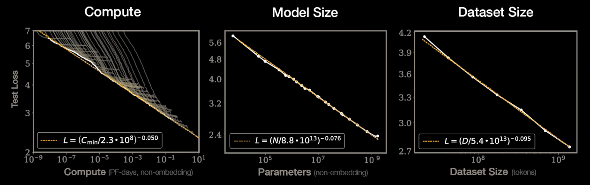
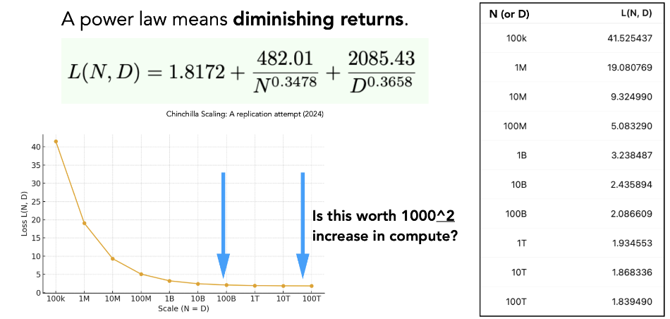

- [Wk 11 LLM](#wk-11-llm)
  - ["Train on the Web"](#train-on-the-web)
    - [Data Sources](#data-sources)
    - [Training Curriculum](#training-curriculum)
    - [LLM Evaluation is becoming Unreliable](#llm-evaluation-is-becoming-unreliable)
  - [Decision Making when training NNs](#decision-making-when-training-nns)
  - [Power Law](#power-law)
    - [Overview](#overview)
    - [How to find optimal N and D](#how-to-find-optimal-n-and-d)
      - [Step 1: Try different model sizes](#step-1-try-different-model-sizes)
      - [Step 2: Determine loss using loss equation](#step-2-determine-loss-using-loss-equation)
      - [Step 3: Repeat 1 and 2 for varying compute budgets](#step-3-repeat-1-and-2-for-varying-compute-budgets)
  - [Takeaways from Kaplan et al. (2020)](#takeaways-from-kaplan-et-al-2020)
  - [Chinchilla enters the room. (2022)](#chinchilla-enters-the-room-2022)
  - [Intentional overtraining](#intentional-overtraining)
  - [Power law diminishing returns...](#power-law-diminishing-returns)
  - [Surprising performance from smaller models surpassing what pure scaling predicts](#surprising-performance-from-smaller-models-surpassing-what-pure-scaling-predicts)
    - [1. Training Curriculum (copied from above)](#1-training-curriculum-copied-from-above)
    - [2. User/Assistant Templates](#2-userassistant-templates)
    - [3. Supervised fine-tuning (SFT) using demonstrations of desired behaviour](#3-supervised-fine-tuning-sft-using-demonstrations-of-desired-behaviour)
      - [LIMA: Less Is More for Alignment](#lima-less-is-more-for-alignment)
  - [Reinforcement Learning](#reinforcement-learning)
    - [Challenges with SFT](#challenges-with-sft)
    - [RL for Human Feedback (RLHF)](#rl-for-human-feedback-rlhf)
    - [RL from "Verifiable" Rewards](#rl-from-verifiable-rewards)
    - [Rejection Fine-Tuning (RFT)](#rejection-fine-tuning-rft)
    - [Policy Gradient Algorithms (REINFORCE)](#policy-gradient-algorithms-reinforce)


# Wk 11 LLM

## "Train on the Web"

### Data Sources

- Must websites are useless gibberish
- Consider:
  - Oversampling good sites (Wikipedia, arXiv, GitHub)
  - Filter based on known heuristics (Upvotes, PageRank)
  - Ask an LLM to "asses quality" and distill into a tiny model
- Remaining pages still need a ton of cleaning and deduplication (HTML, JavaScript, Boilerplate --> clean text for next token prediction)

### Training Curriculum

- Use broad general dataset mostly from the web for early training
- Use higher-quality, more code/math-heavy dataset to sharpen reasoning and programming ability for late training

For SmolLM3:

| Phase         |                               Purpose |     Token count | Data mix                                             |
| ------------- | ------------------------------------: | --------------: | ---------------------------------------------------- |
| **Phase I**   |                         Base training |   **8T tokens** | Mostly web: **85% web, 12% code, 3% math**           |
| **Phase II**  |                High-quality injection |   **2T tokens** | More curated data: **75% web, 15% code, 10% math**   |
| **Phase III** | Learning-rate decay / final polishing | **1.1T tokens** | Even more code/math: **63% web, 24% code, 13% math** |

### LLM Evaluation is becoming Unreliable

**Contamination**: Benchmarks/test questions may appear in the pretraining data

**Explicit hill-climbing**: Labs train/validate directly against popular benchmarks

**Emergence**: As models get bigger, some abilities appear suddenly, so a benchmark may fail to predict when a model is about to become good at something. (The benchmark does not give a smooth, useful picture of progress)

## Decision Making when training NNs

Which data, architecture or hyperparams to use?

**Idea #1**: Train M modes with 1/M the budget each.
- Pick the best performing one.
- But your model only used 1/30 of your budget.

**Idea #2**: Tune hyperparams at small scale.
- "This drug dose worked in mice, so use the same dose in humans."
- But hyperparam choice at small scale does not scale to large scale easily

**Idea #3**: Scaling laws.
- "Measure how dose-response changes with body size, then predict the human dose."
- Maybe we train and tune may smaller models with small amounts of data and extrapolate

## Power Law

### Overview

Shown empirically.

$$L(X) = X^{-\alpha}$$

- $X$ is the resource being scaled
- $L(X)$ is the validation/test loss after training with that amount of resource
- $\alpha$ is the scaling component (model/dataset dependent)

$X$ might be:
- $\text{Dataset size (D)}$:
  - $D$ is the number of training tokens
  - $D=\text{batch size}\cdot \text{sequence length} \cdot \text{training steps}$
  - $L(D) = D^{-\alpha}$
- $\text{Compute (C)}$:
  - $N$ is number of training parameters
  - $D$ is the number of training tokens
  - $C \approx 6ND$ (2 flops per param, need forward pass, backward pass, update grads)

Usually you count both:

$$
L(N, D) = L_\infty + \frac{A}{N^\alpha} + \frac{B}{D^\beta}
$$

- $N$ is the **number of model parameters**.
- $D$ is the **number of training tokens / data size**.
- $L(N,D)$ is the **expected validation/test loss** after training with model size $N$ and data size $D$. I.e., the negative log-likelihood (log perplexity)
- $E$, $A$, $B$, $\alpha$, $\beta$ are fitted values
  - $L_\infty$ is the **irreducible loss floor**, i.e. the best possible loss even with infinite model/data.
  - $A$ is the **coefficient for model-size-limited loss**.
  - $\alpha$ is the **scaling exponent for model size**, i.e. how fast loss improves as $N$ increases.
  - $B$ is the **coefficient for data-limited loss**.
  - $\beta$ is the **scaling exponent for data size**, i.e. how fast loss improves as $D$ increases.



### How to find optimal N and D

1. Try several model sizes $N$ (e.g., 100M, 300M, 1B, 3B)
2. For each $N$, train for different $D$ (e.g., 20B, 60B, 180B tokens)
3. Record loss and compute cost 

Material example:

Say we have the following loss equation:

$$
L(N,D) = 1.8 + \frac{0.4}{\sqrt{N}} + \frac{1.79}{\sqrt{D}}
$$

Where compute is roughly $C = 6ND$

Say we fix compute at $C = 600$, then $ND = 100$

#### Step 1: Try different model sizes

All of which use the same compute (100)

| (N) params | Required (D) tokens | Why                           |
| ---------: | ------------------: | ----------------------------- |
|       0.5B |                200B | small model, lots of data     |
|         1B |                100B | medium-small model            |
|         2B |                 50B | balanced-ish                  |
|         5B |                 20B | large model, less data        |
|        10B |                 10B | very large model, little data |

#### Step 2: Determine loss using loss equation

|  (N) |  (D) |      Loss |
| ---: | ---: | --------: |
| 0.5B | 200B |     2.492 |
|   1B | 100B |     2.379 |
|   2B |  50B | **2.336** |
|   5B |  20B |     2.379 |
|  10B |  10B |     2.493 |

So for compute budget $C = 600$, then best allocation is $N_{\text{opt}}, D_{\text{opt}} = (2B, 50B)$

#### Step 3: Repeat 1 and 2 for varying compute budgets

| Compute (C) | Best (N) | Best (D) |
| ----------: | -------: | -------: |
|         150 |    ~1.1B |     ~22B |
|         600 |    ~2.2B |     ~45B |
|        2400 |    ~4.5B |     ~89B |

Now fit a curve for:

$$
N_\text{opt} \propto C^a\qquad \text{and}\qquad D_\text{opt} \propto C^b
$$

## Takeaways from Kaplan et al. (2020)

- Test loss scales as power law of data, parameter count, and compute...
- Test loss is more sensitive to parameter count than data (later disputed)
- Larger models require less data to reach same performance, so don't train to convergence, instead train larger models for fewer steps

Overall this means: as compute increases, you should spend proportionally more of it on parameters than on extra data.

I.e., bigger model, fewer tokens per parameter. Which is the regime chosen by GPT3 (2 tokens/param) vs say Chinchilla (20 tokens/param) or Llama 2 70B (29 tokens/param)

## Chinchilla enters the room. (2022)

- Deepmind confirmed power-law scaling
- Disputed optimal allocation between data and parameters

Chinchilla found that the compute-optimal strategy is roughly:

$$
N_\text{opt} \propto C^{0.5}\qquad \text{and}\qquad D_\text{opt} \propto C^{0.5}
$$

So if compute increases by $4\times$, then roughly:
- model size $N$ should increase by $2\times$
- data $D$ should increase by $2\times$

## Intentional overtraining

Intentionally overtraining a small model may be desirable as it will be cheaper to run during inference. Therefore there is a shift towards overtraining.

| Model | Tokens per parameter |
|---|---:|
| GPT-3 | 2 |
| Chinchilla | 20 |
| LLaMA 65B | 22 |
| Llama 2 70B | 29 |
| Mistral 7B | 110 |
| Llama 3 70B | 215 |


## Power law diminishing returns...



## Surprising performance from smaller models surpassing what pure scaling predicts

Number of ways to achieve this:

### 1. Training Curriculum (copied from above)

- Use broad general dataset mostly from the web for early training
  - Learn language and build very strong priors in earlier stages
- Use higher-quality, more code/math-heavy dataset to sharpen reasoning and programming ability for late training
  - Learn "high-quality" bias to get the behaviour we actually want

For SmolLM3:

| Phase         |                               Purpose |     Token count | Data mix                                             |
| ------------- | ------------------------------------: | --------------: | ---------------------------------------------------- |
| **Phase I**   |                         Base training |   **8T tokens** | Mostly web: **85% web, 12% code, 3% math**           |
| **Phase II**  |                High-quality injection |   **2T tokens** | More curated data: **75% web, 15% code, 10% math**   |
| **Phase III** | Learning-rate decay / final polishing | **1.1T tokens** | Even more code/math: **63% web, 24% code, 13% math** |

### 2. User/Assistant Templates

Native separation between system/user/assistant turns.

```
<|im_start|>system
broad system instructions
<|im_end|>

<|im_start|>user
User request.
<|im_end|>

<|im_start|>assistant
Visible response!
<|im_end|>
```

### 3. Supervised fine-tuning (SFT) using demonstrations of desired behaviour

Loss function is identical to pretraining.

However during SFT loss is applied mainly to answer/output tokens, not prompt tokens.

How to get SFT data?
- Actual deployed interactions
- Data vendsors, based on detailed specifications
- Use existing LLMs + complex processes to synthesize stuff

#### LIMA: Less Is More for Alignment

- Idea is that model learns most factual/world knowledge during pretraining
- SFT is just for focusing the style of the model
- So you only need a small number of high-quality instruction examples to teach the model how to express/use the knowledge it already has

Because only a few SFT examples are needed, every example can have a big effect on behaviour.

For example:

1. ```
    Q: What is the population of <small town> in Mar ’26?
    A: 23,241 people
    ```
    Model may learn that, for specific factual questions, give a precise answer confidently. But the population of a small town at a future date may be uncertain, unavailable, or outdated. A better assistant might say `I'd need a current source to answer that accurately`.

2. ```
    Q: What is the capital city of the US?
    A: Washington, D.C.
    ```
    This is safer because it is a stable, common fact. The model may learn `for simple stable factual questions, answer directly` which is probably desired.

## Reinforcement Learning

### Challenges with SFT

- What if there are many OK answers?
- What if model's answer is better than our human label?

Can the model actually learn the underlying process, which is required for generalisation, from a bunch of demonstrations?

Enter RL.

### RL for Human Feedback (RLHF)

Show annotators multiple responses and are them to rank from best to worst

### RL from "Verifiable" Rewards

Implement scalar reward function $R(x,y)$
- $x$ is prompt/question
- $y$ is model's proposed answer
- Can be binary or give partial credit

### Rejection Fine-Tuning (RFT)

**Offline** (data generation and training are separate)

1. Take current model
2. For each prompt, sample K answers
3. Score answers with R(x,y)
4. Keep good answers
5. Make a fixed dataset of <x, good y>
6. Run SFT for many gradient steps/epochs on that dataset

**Online** (interleave data generation and training)

repeat:
 1. Take current model
 2. Sample answers for a batch of prompts
 3. Score with R(x,y)
 4. Keep/use high-reward answers
 5. Take one or more SFT gradient steps

**Problems with RFT**
1. We don't learn from failed examples
2. We may memorise sub-optimal answers from early in training and fail to progress further
3. We may diverge too far from the original model in a way that hinders generalisation to *other* distribution tasks

### Policy Gradient Algorithms (REINFORCE)

$$ \nabla_\theta \mathbb{E}\left[ R(x,y) \right] =
\mathbb{E}\left[ R(x,y)\,\nabla_\theta \log \pi_\theta(y \mid x) \right]
$$

LHS: gradient of the model’s average reward

RHS: estimate that gradient using the gradient of the log-probability that the model assigned to the sampled answer, weighted by reward

Thererfore if y got high reward:
- increase $\log \pi_\theta(y \mid x)$
- → make that answer more likely next time

If y got low reward:
- weak/no increase
- → don't reinforce that answer