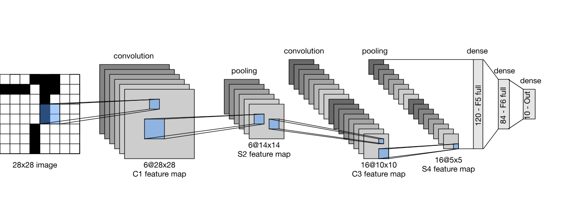
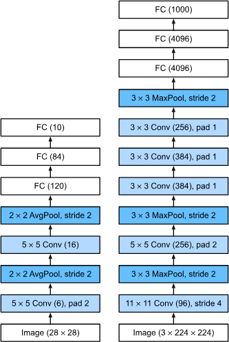

# Takeaways

## (VGG) 2 3x3 vs 1 5x5 Convolution

- Simonyan and Zisserman (2014) (VGG Creators) showed that deep and narrow networks significantly outperform their shallow counterparts.
- Key insight was showing that stacking multiple 3x3 convs gives:
  - same effective receptive field as a larger kernel (two 3x3s = one 5x5, three 3x3s = one 7x7)
  - but with fewer parameters
  - and more nonlinearities

## (NiN)

Problems with existing models (LeNet, AlexNet, VGG):
- Fully connected layers at the end of the architecture consume tremendous numbers of parameters
- Impossible to add fully connected layers earlier in the network to increase the degree of nonlinearity: doing so would destroy the spatial structure and require potentially even more memory

This is fixed with NiN:
- Applies a fully connected layer at each pixel location (for each height and width). The resulting convolution can be thought of as a fully connected layer acting independently on each pixel location.

They were proposed on a simple insight:
- (i) use convolutions to add local nonlinearities across the channel activations
- (ii) use global average pooling to integrate across all locations in the last representation layer

# Architectures

## LeNet

One of the first published CNNs; 1995.



```python
class LeNet(nnx.Module):
    def __init__(self, rngs: nnx.Rngs, image_size=28, num_classes=10):
        flattened_size = int((((image_size / 2) - 4) / 2) ** 2 * 16)
        self.conv1 = nnx.Conv(1, 6, (5, 5), padding="SAME", rngs=rngs)
        self.conv2 = nnx.Conv(6, 16, (5, 5), padding="VALID", rngs=rngs)
        self.fc1 = nnx.Linear(flattened_size, 120, rngs=rngs)
        self.fc2 = nnx.Linear(120, 84, rngs=rngs)
        self.fc3 = nnx.Linear(84, num_classes, rngs=rngs)

    def __call__(self, x):
        x = nnx.sigmoid(self.conv1(x)) # n n 6
        x = nnx.avg_pool(x, (2, 2), strides=(2, 2), padding="VALID") # n/2 n/2 6
        x = nnx.sigmoid(self.conv2(x)) # n/2-4 n/2-4 16
        x = nnx.avg_pool(x, (2, 2), strides=(2, 2), padding="VALID") # (n/2-4)/2 (n/2-4)/2 16
        x = x.reshape(x.shape[0], -1) # (n/2-4)/2 * (n/2-4)/2 * 16
        x = nnx.sigmoid(self.fc1(x))
        x = nnx.sigmoid(self.fc2(x))
        return self.fc3(x)
```

## AlexNet

Won the ImageNet Large Scale Visual Recognition Challenge 2012.



``` python
class AlexNet(nnx.Module):
    def __init__(self, rngs: nnx.Rngs, image_size=224, num_classes=100):
        self.features = nnx.Sequential(
            nnx.Conv(3, 96, (11,11), (4,4), padding=(1,1), rngs=rngs), nnx.relu,
            MaxPool((3,3), (2,2)),
            nnx.Conv(96, 256, (5,5), padding="SAME", rngs=rngs), nnx.relu,
            MaxPool((3,3), (2,2)),
            nnx.Conv(256, 384, (3,3), padding=(1,1), rngs=rngs), nnx.relu,
            nnx.Conv(384, 384, (3,3), padding=(1,1), rngs=rngs), nnx.relu,
            nnx.Conv(384, 256, (3,3), padding=(1,1), rngs=rngs), nnx.relu,
            MaxPool((3,3), (2,2)),
        )

        dummy_data = ShapeDtypeStruct((1, image_size, image_size, 3), jnp.float32)
        dummy_shape = eval_shape(self.features, dummy_data).shape
        flattened_size = prod(dummy_shape[1:])

        self.classifier = nnx.Sequential(
            nnx.Linear(flattened_size, 4096, rngs=rngs), nnx.relu,
            nnx.Dropout(0.5, rngs=rngs),
            nnx.Linear(4096, 4096, rngs=rngs), nnx.relu,
            nnx.Dropout(0.5, rngs=rngs),
            nnx.Linear(4096, num_classes, rngs=rngs)
        )

    def __call__(self, x):
        x = self.features(x)
        x = x.reshape(x.shape[0], -1)
        x = self.classifier(x)
        return x
```

## VGG

The idea of using blocks first emerged from the Visual Geometry Group (VGG) at Oxford University, in their eponymously-named VGG network.

A VGG block is $n$ (3x3 conv, relu) layers each with $k$ out_features followed by $1$ max_pool layer window_size=(2,2), stride=(2,2).

Example arches:

```
format = [(n,k), ...]
vgg11_arch = [(1, 64), (1, 128), (2, 256), (2, 512), (2, 512)]
vgg16_arch = [(2, 64), (2, 128), (3, 256), (3, 512), (3, 512)]
vgg19_arch = [(2, 64), (2, 128), (4, 256), (4, 512), (4, 512)]
```

```python
class VGG_Block(nnx.Module):
    def __init__(self, num_convs, in_channels, out_channels, rngs: nnx.Rngs):
        layers = []
        for i in range(num_convs):
            layers.append(nnx.Conv(in_channels if i == 0 else out_channels, out_channels, kernel_size=(3,3), padding=(1,1), rngs=rngs))
            layers.append(nnx.relu)
        self.layers = nnx.Sequential(*layers, MaxPool((2,2), (2,2)))
    
    def __call__(self, x):
        return self.layers(x)

class VGG(nnx.Module):
    def __init__(self, arch: list[tuple[int,int]], rngs: nnx.Rngs, image_size, in_channels=3, num_classes=10):
        layers = []
        temp_in_channels = in_channels
        for (num_convs, out_channels) in arch:
            layers.append(VGG_Block(num_convs, temp_in_channels, out_channels, rngs=rngs))
            temp_in_channels = out_channels
        
        self.features = nnx.Sequential(*layers)
        
        dummy_data = ShapeDtypeStruct((1, image_size, image_size, in_channels), jnp.float32)
        dummy_shape = eval_shape(self.features, dummy_data).shape
        flattened_size = prod(dummy_shape[1:])

        self.classifier = nnx.Sequential(
            nnx.Linear(flattened_size, 4096, rngs=rngs), nnx.relu,
            nnx.Dropout(0.5, rngs=rngs),
            nnx.Linear(4096, 4096, rngs=rngs), nnx.relu,
            nnx.Dropout(0.5, rngs=rngs),
            nnx.Linear(4096, num_classes, rngs=rngs)
        )

    def __call__(self, x: jnp.ndarray):
        x = self.features(x)
        x = x.reshape(x.shape[0], -1)
        x = self.classifier(x)
        return x
```

## NiN

```python
class NiN_Block(nnx.Module):
    def __init__(self, in_features, out_features, kernel_size, strides, rngs: nnx.Rngs, padding:PaddingLike = "VALID"):
        self.layers = nnx.Sequential(
            nnx.Conv(in_features, out_features, kernel_size=kernel_size, strides=strides, padding=padding, rngs=rngs),
            nnx.relu,
            nnx.Conv(out_features, out_features, (1,1), rngs=rngs),
            nnx.relu,
            nnx.Conv(out_features, out_features, (1,1), rngs=rngs),
            nnx.relu
        )

    def __call__(self, x):
        return self.layers(x)

class NiN(nnx.Module):
    def __init__(self, rngs: nnx.Rngs, num_classes=10):
        self.layers = nnx.Sequential(
            NiN_Block(3, 96, (11,11), (4,4), rngs=rngs),
            MaxPool((3,3), (2,2)),
            NiN_Block(96, 256, (5,5), (1,1), rngs=rngs, padding="SAME"),
            MaxPool((3,3), (2,2)),
            NiN_Block(256, 384, (3,3), (1,1), rngs=rngs, padding="SAME"),
            MaxPool((3,3), (2,2)),
            nnx.Dropout(0.5, rngs=rngs),
            NiN_Block(384, num_classes, (3,3), (1,1), rngs=rngs, padding="SAME"),
        )

    def __call__(self, x: jnp.ndarray):
        x = self.layers(x)
        x = x.mean(axis=(1,2)) # NHWC; C=10
        return x
```