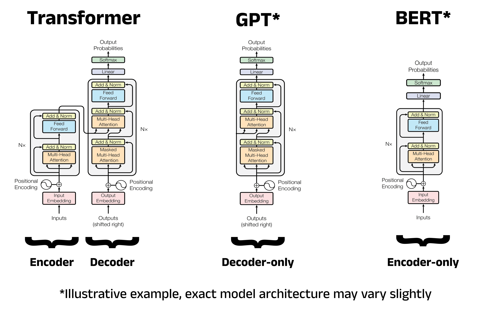
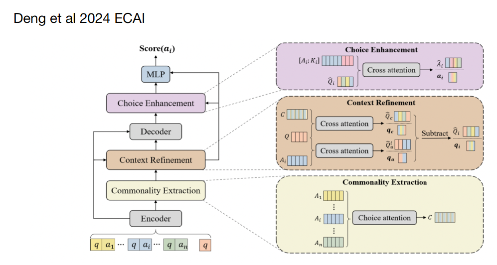

# What we actually do

Old setup: `word → pretrained GloVe vector → downstream model`

New setup: `text → subword tokeniser → learned subword embeddings → Transformer` (used by all pre-trained models) (subword representations randomly initialised and learned in the transformer model)

Tokenisation today uses subword tokenisation with tuned vocabulary (usually 50k to 250k pieces, larger for multilingual models)
- Subword tokenisation is better able to handle rare words and new words (e.g., "unicorn" may be tokenised as "uni" + "corn")
- More efficient than character-level tokenisation
- (something something wordpieces are more generalisable to new text compared to words)

Space handling is dependent on the tokeniser. E.g., BERT uses WordPiece tokeniser which adds a special character to indicate that a token is not at the start of a word (e.g., "unicorn" → "uni" + "##corn"). GPT uses Byte Pair Encoding (BPE), elaborated below.

Random note:
- Translation: preserve meaning
- Transliteration: preserve sound

## Byte Pair Encoding (BPE)

Two styles:
1. Treats spaces as normal characters (e.g., may get "hello world" → "hello" + " world")
2. Split on space and add a end of word token (e.g., may get "hello world" → "hello</w>" + "world</w>")

Algorithm
1. Count all adjacent symbol pairs across the entire corpus
2. Find the most frequent pair (e.g., l o)
3. Merge that pair into a single new symbol (e.g., lo)
4. Add the new symbol to the vocabulary
5. Repeat until the vocab reaches a predefined size

So overall
- Frequent words end up as single tokens; rare words broken into subword pieces
- Out of vocab words can be represented by falling back on smaller subword units
- Vocab size is a hyperparameter that is set in advance (e.g., 32000)
- Learned rules are applied determinstically at inference time to new text
- Naturally capturs morphological structure (prefixes, suffixes e.g., un, ing, er)

# Embeddings

In general an LLM or RNN can learn its own embeddings. However it is possible to use pretrained word embeddings.

These methods include:
- Word2Vec
- GloVe
- Elmo
- BERT

Moving from **Word2Vec/Glove** to **Elmo**:
- Word2Vec/Glove: static word embeddings, each word has a single embedding regardless of context
- Elmo: contextual word embeddings, each word has a different embedding depending on the context it

Note using these pretrained embeddings is a form of self-supervised pretraining.

We may start with a large unannotated dataset, use these self-supervised methods to learn embeddings, then apply it to a model with small hand-annotated data.

Note, we don't have to use these fancy schmancy systems. GPT uses a learned embedding layer (with added position information) so effectively the contextual embeddings are produced inside the Transformer itself.

## Word2Vec

- Uses shallow neural network to learn word associations
- Two architectures:
  - Continuous Bag of Words (CBOW) (predict a target word from its surrounding context words)
  - Skip-Gram (predict surrounding context words from a single given target)

In a nutshell:

We have a dataset like `shall I compare thee to a summers day thou art more lovel`, we create a dataset like:
- `(x, y)`
- `(compare, shall)`,
- `(compare, I)`,
- `(compare, thee)`,
- `(compare, to)`,
- `(thee, I)`,
- `(thee, compare)`,
- `(thee, to)`,
- `(thee, a)`,
- ...

Then we train a model to predict y given x.

```python
class SkipGramFullSoftmax(nnx.Module):
    def __init__(self, vocab_size: int, emb_dim: int, *, rngs: nnx.Rngs):
        self.embed = nnx.Embed(
            num_embeddings=vocab_size,
            features=emb_dim,
            rngs=rngs,
        )

        self.output = nnx.Linear(
            in_features=emb_dim,
            out_features=vocab_size,
            use_bias=False,
            rngs=rngs,
        )

    def __call__(self, centre_ids, context_ids):
        # centre_ids: [B]
        # context_ids: [B]

        h = self.embed(centre_ids)      # [B, D]
        logits = self.output(h)         # [B, V]

        loss = optax.softmax_cross_entropy_with_integer_labels(
            logits=logits,
            labels=context_ids,
        ).mean()

        return loss
```

However in the above code we compute the probability of every token in the output which is expensive. Instead we can use negative sampling to only compute the probability of a few negative samples and one positive sample.

In the prior code we had the transform:
- (B, V) → (B, D) → (B, V)

Since the inputs and outputs are one-hot encoded, this is effectively the same as a lookup in a weight matrix. Therefore we can replace the linear layer with an embedding layer.

```python
class SkipGramNegativeSampling(nnx.Module):
    def __init__(self, vocab_size: int, emb_dim: int, *, rngs: nnx.Rngs):
        self.in_embed = nnx.Embed(
            num_embeddings=vocab_size,
            features=emb_dim,
            rngs=rngs,
        )

        self.out_embed = nnx.Embed(
            num_embeddings=vocab_size,
            features=emb_dim,
            rngs=rngs,
        )

    def __call__(self, centre_ids, pos_context_ids, neg_context_ids):
        # centre_ids: [B]
        # pos_context_ids: [B]
        # neg_context_ids: [B, K]

        centre = self.in_embed(centre_ids)            # [B, D]
        pos = self.out_embed(pos_context_ids)         # [B, D]
        neg = self.out_embed(neg_context_ids)         # [B, K, D]

        # Real context score
        pos_logits = jnp.sum(centre * pos, axis=-1)   # [B]

        # Negative context scores
        neg_logits = jnp.einsum("bd,bkd->bk", centre, neg)  # [B, K]

        loss = -(
            jax.nn.log_sigmoid(pos_logits)
            + jnp.sum(jax.nn.log_sigmoid(-neg_logits), axis=-1)
        ).mean()

        return loss
```

## GloVe

- Unsupervised
- Trains very fast
- Uses local sliding context window to learn relationships (the word is defined by the company it keeps)

## ELMo

- Uses character-based word representations
- CNN to learn 512-dim word embedding from characters
- Bidirectional LSTM (not Seq2Seq) to learn contextual word representations
- Pre-trained as a language model

For the $k$-th word in the sequence:
- $h_k^{\text{init}}$ is the non-contextual embedding, generated by the character-based CNN
- $h_{k,y}^{\text{forward}}$ is the forward LSTM output
- $h_{k,y}^{\text{backward}}$ is the backward LSTM output

$e_k$ will be the final embedding for the $k$-th word
- Effectively a weighted sum of the three components
- $\gamma^i$, $\gamma$, $f_j$, $b_j$ are learned

$$
\mathbf e_k
=
\gamma^{i}\mathbf h^{\text{init}}_k
+
\gamma \sum_{j=0}^{L} f_j \mathbf h^{\text{forward}}_{k,j}
+
\gamma \sum_{j=0}^{L} b_j \mathbf h^{\text{backward}}_{k,j}
$$

ELMo is pretrained with a bidirectional language modelling loss, meaning the forward LSTM tries to predict the next word and the backward LSTM tries to predict the previous word, we then sum them:

$$
\mathcal L_{\text{ELMo}}
=
-\sum_{k=1}^{N}
\left[
\log P(w_k \mid w_1,\dots,w_{k-1})
+
\log P(w_k \mid w_{k+1},\dots,w_N)
\right]
$$

## BERT

- Bidirectional Encoder Representations from Transformers
- Pretty much called bidirectional because the attention head is non-causal

Pretty much text → WordPiece tokens (subword tokeniser) → embedding lookup → encoder Tranformer

How do you use the embeddings from BERT? Just the outputs:
- `[CLS] The patient has chest pain [SEP]`
- BERT outputs one contextual vector per token: `h_CLS, h_The, h_patient, h_has, h_chest, h_pain, h_SEP`

Training paradigms:
- Masked language modelling (MLM): randomly mask out some tokens and train the model to predict the original tokens (trained by taking an original sentence, masking out/corrupting some of the tokens, and then training the model to predict the original tokens)
- Next sentence prediction (NSP): train the model to predict if two sentences are adjacent in the original text (trained by taking pairs of sentences, some of which are adjacent in the original text and some of which are not, and then training the model to predict whether the sentences are adjacent or not)
  - Input: `[CLS] sentence A [SEP] sentence B [SEP]`
  - Output: binary classification on the `[CLS]` token
  - `CLS` stands for `classification token`
  - $h_{\text{CLS}} \rightarrow \text{classifier} \rightarrow \{\text{is next}, \text{not next}\}$

Embeddings:
- Position embeddings are learned. I.e., $E_{\text{pos}}(t)$
- Segment embeddings are learned. I.e., $E_{\text{seg}}(s)$ where $s$ is the segment id (0 for sentence A, 1 for sentence B)

$$
L_{\text{BERT}} = L_{\text{MLM}} + L_{\text{NSP}}
$$

MLM teaches token-level context; NSP was intended to teach sentence-pair relationships. Later models like RoBERTa found NSP was not very useful and removed it.

Uses:

1. Can capture interactions between two sentences in the classification token. E.g., does the first sentence entail/contradict/neutral the second sentence?

    After BERT pretraining, you can freeze weights and train a small classifier head on top of the `CLS token`. Alternatively you can do the whole thing end-to-end and fine-tune the BERT weights as well.

2. Question answering (SQuAD)

    SQuAD is **Stanford Question Answering Dataset**

    The model is given context paragraph and a question, and it has to predict the start and end token indices of the answer span in the context paragraph.

    E.g.,
    ```
    Context: The heart pumps blood through the circulatory system.
    Question: What does the heart pump?
    Answer: blood
    ```

    BERT input will look like `[CLS] question [SEP] paragraph [SEP]`

    BERT output will look like $h_{\text{CLS}}, h_1, h_2, \dots, h_n$

    We then have two linear layers that take in the hidden states and output a score for each token being the start or end of the answer:
    - $s_t = W_{\text{start}} h_t + b_{\text{start}}$ (score for token $t$ being the start of the answer)
    - $e_t = W_{\text{end}} h_t + b_{\text{end}}$ (score for token $t$ being the end of the answer)

What it can't do:

- Cannot generation text (can fill in mask tokens, cannot generate left-to-right unless putting a mask token at the end repeatedly, but this is slow)
- Primary use is analysis tasks (classification, question answering, etc.) rather than generation tasks

> [!CAUTION]
> ANKI UP TO HERE

Fine-tuning:

- Basic fine-tuning settings:
  - 1-3 epochs, 2-32 batch size, 2e-5 to 5e-5 learning rate.
  - Need learning rate slow enough as to not destroy pretrained knowledge (too high and this is called catastrophic forgetting)
- Triangular learning rate
  - Start with slow learning rate, then increase to a peak, then decrease again
  - BERT is sensitive during fine-tuning. Bad learning rates can make performance collapse
- "Large changes up here, smaller changes lower down"
    ```
    Lower layers: basic language features
    Middle layers: syntax / phrase structure
    Upper layers: task-specific meaning
    Classifier head: task decision
    ```
    So:
    - the classifier head changes a lot, because it is newly added
    - the top BERT layers change moderately, because they adapt to the task
    - the lower BERT layers change less, because basic language features are already useful

## Fancy BERT MCQ



Standard BERT MCQ:

1. [CLS] question [SEP] choice_i [SEP]
2. BERT
3. CLS vector
4. linear layer
5. score(choice_i)

Fancy BERT MCQ: (Differentiating Choices via Commonality for Multiple-Choice Question Answering)

Structure:

### Layer Details: Deng et al. DCQA

Question: $q$  
Choices: $a_1, a_2, \ldots, a_n$

- Context Representation
  - Encode the question alone:
    - $Q = \operatorname{Encoder}(q)$
    - $Q \in \mathbb{R}^{l \times d}$
  - Encode each question-choice pair:
    - $A_i = \operatorname{Encoder}(q + a_i)$
    - $A_i \in \mathbb{R}^{m \times d}$

- Commonality Extraction
  - Compare every choice with every other choice.
  - This is their **choice attention**.
  - For choice $i$ attending to choice $j$:
    - $S_{ij} = \operatorname{softmax}(A_i W_{ij} A_j^\top)$
  - Use $S_{ij}$ to pull shared information from $A_j$:
    - $S_{ij}A_j$
  - Aggregate over all pairwise choice comparisons:
    - $C = \frac{1}{n}\sum_i \sum_{j \ne i} S_{ij}A_j$
  - $C$ is the commonality representation.
  - Intuition:
    - $C \approx$ “what the answer choices share”

- Context Refinement
  - Goal:
    - Find which parts of the question relate to each choice.
    - Subtract the parts that relate to commonality.
  - Cross-attention between question and commonality:
    - $\hat{Q}^c, q^c = \operatorname{Att}_{cross}(Q; C)$
  - Cross-attention between question and each choice:
    - $\hat{Q}_i^a, q_i^a = \operatorname{Att}_{cross}(Q; A_i)$
  - Remove commonality-related question information:
    - $\hat{Q}_i = \hat{Q}_i^a - \hat{Q}^c$
    - $q_i = q_i^a - q^c$
  - Intuition:
    - refined question for choice $i$ = “question features relevant to choice $i$, minus features relevant to all choices”

- Decoder
  - Use the refined question representation to generate/activate extra contextual information:
    - $K_i = \operatorname{Decoder}(\hat{Q}_i)$
  - Intuition:
    - $K_i \approx$ generated clue/context for this specific choice

- Choice Enhancement
  - Enhance the choice using both:
    - original choice representation $A_i$
    - generated clue/context $K_i$
  - Concatenate:
    - $[A_i; K_i]$
  - Cross-attend this against the refined question:
    - $\hat{A}_i, a_i = \operatorname{Att}_{cross}([A_i; K_i]; \hat{Q}_i)$

- Scoring
  - Combine:
    - $q_i$ = refined question vector for choice $i$
    - $a_i$ = enhanced choice vector for choice $i$
  - Score:
    - $\operatorname{score}(a_i) = \operatorname{softmax}(\operatorname{MLP}([q_i; a_i]))$
  - Choose the answer with the highest score.