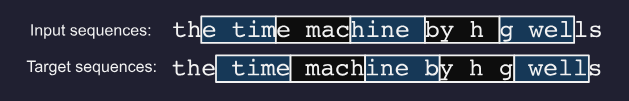
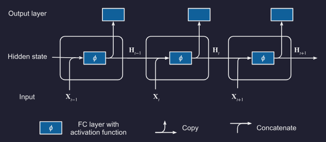
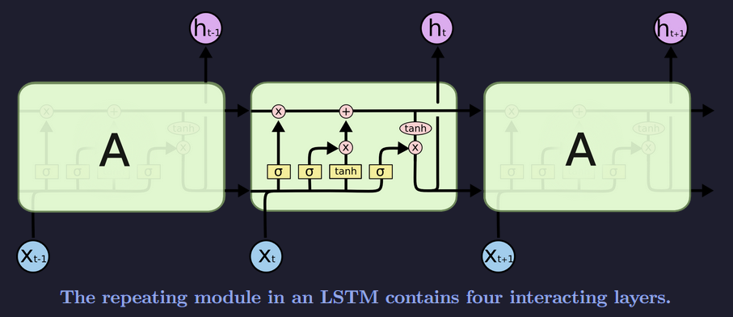
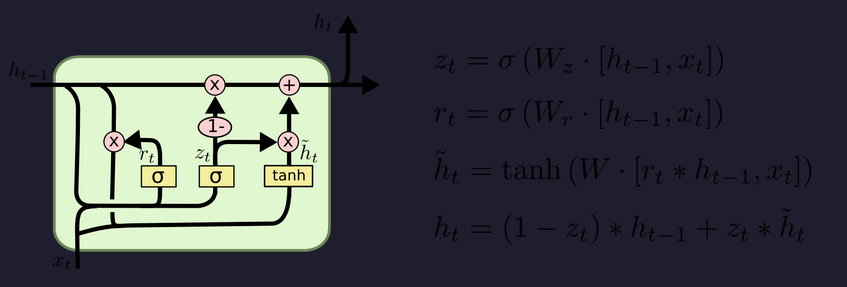
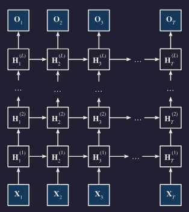
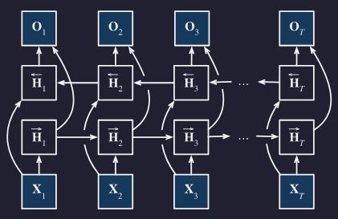
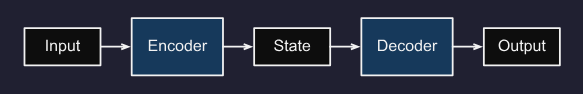

Need to read ~~9.1~~, ~~9.2~~ and ~~9.3~~ again

Need to go through ~~10.5~~, ~~10.6~~, ~~10.7~~, 10.8

Up to 10.7.3.

# Recurrent Neural Networks

## Coming From Non-Sequential Data

Previously we assumed data was sampled from some $P(X)$. We still assume that the entire sequence is sampled independently. Tokens within a sequence are not assumed to be independent.

## Sequence Modelling

### Intro

I.e., to estimate the probability mass function that tells us how likely we are to see any given sequence $p(\mathbf{x}_1, \dots, \mathbf{x}_T$).

Note while we may be interested in the probability distribution $P(x_t \mid x_{t-1}, \dots, x_1)$, this can be difficult. We may try $\mathbf{E}[(x_t \mid x_{t-1}, \dots, x_1)]$ instead.

Trying to regress the value of a signal based on previous values of the same signal is an autoregressive model. In sequential data, we often need strategies to handle sequences of varying length. Strategies may include:
1. Condition only on some window of length $\tau$ and only use $x_{t-1}, \dots, x_{t-\tau}$ observations. This would allow us to use any linear model or deep network that requires fixed-lenght inputs as features.
2. Develop a model that maintains some summary $h_t$ of past observations and at the same time update $h_t$ in addition to $\hat{x}_t$. This would give us a model that estimates $x_t$ with $\hat{x}_t = P(x_t \mid h_t)$ and updates $h_t = g(h_{t-1}, x_{t-1})$. As $h_t$ is an internal hidden state, this is called a latent autoregressive model.

When we take a long historical sequence and cut it into many smaller training examples, we make the assumption that while actual values can change over time, the dynamics according to which each subsequent observation is generated given the previous observations do not. Dynamics that do not change are called stationary.

### Sequence Models

When we wish to estimate the joint probability of an entire sequence (and for language data they are called language models).

How is this an autoregressive problem? Consider:

$$
P(x_1, \dots, x_T) = P(x_1) \prod^T_{t=2} P(x_t \mid x_{t-1}, \dots, x_1)
$$

Let 
$$x_1 = \text{The}, \quad x_2 = \text{cat}, \quad x_3 = \text{slept}$$

The probability of the whole sequence is:
$$P(\text{The, cat, slept})$$

Using the chain rule:
$$
P(x_1, x_2, x_3) = P(x_1)P(x_2 \mid x_1)P(x_3 \mid x_1, x_2)
$$

So:
$$
P(\text{The cat slept}) =
P(\text{The})
\times
P(\text{cat} \mid \text{The})
\times
P(\text{slept} \mid \text{The cat})
$$

Therefore modelling the joint probability of a whole sequence can be rewritten as modelling a series of next-token probabilities.

### Markov Models

A Markov model assumes that the future only depends on a fixed number of recent previous timesteps, not the entire history.

For a window length $\tau$, we predict $x_t$ using only $x_{t-1}, \dots, x_{t-\tau}$ rather than the full history $x_{t-1}, \dots, x_1$.

This is the Markov condition:

$$
P(x_t \mid x_{t-1}, \dots, x_1)
=
P(x_t \mid x_{t-1}, \dots, x_{t-\tau})
$$

I.e., once we know the recent history, the older history provides no additional predictive information.

If $\tau = 1$, this is a first-order Markov model. The next token only depends on the previous token:

$$
P(x_1, \dots, x_T)
=
P(x_1)\prod_{t=2}^{T}P(x_t \mid x_{t-1})
$$

If $\tau = k$, this is a $k^\text{th}$-order Markov model. The next token depends on the previous $k$ tokens.

This assumption is often only approximately true. In real language, earlier context can still matter, but the benefit of adding more past context usually diminishes.

Markov models are useful because they reduce the computational problem from:

$$
P(x_t \mid x_{t-1}, \dots, x_1)
$$

to something shorter and fixed-length:

$$
P(x_t \mid x_{t-1}, \dots, x_{t-k})
$$

For discrete data like language, a simple Markov model can estimate probabilities by counting how often each token occurs after each context. This is basically an $n$-gram style model.

### Converting Raw Text into Sequence Data

Tokens are indivisible units of text. Each timestep corresponds to 1 token.

Breaking text into tokens usually includes:
1. Split/encode text into tokens/subwords/characters/words (e.g., unigram, wordpiece, bytepair)
2. A vocab associates each distinct token value with a unique index (the vocabulary is the fixed list/set of all allowed token types, usually with IDs).
3. Map IDs to vectors

Usually tokenisation refers to steps 1 and 2. Embedding refers to step 3.

Embedding associates each unique index with a vector of $\mathbb{R}^d$ where $d$ is the embedding dimension.

The embedding dimension, also called embedding size, hidden size, model dimension, or $d_{\text{model}}$, is the length of the vector used to represent each token.

## Language Models

$$
P(x_1, x_2, \ldots, x_T) = \prod_{t=1}^T P(x_t  \mid  x_1, \ldots, x_{t-1}).
$$

For ex:

$$
\begin{split}\begin{aligned}&P(\textrm{deep}, \textrm{learning}, \textrm{is}, \textrm{fun}) \\
=&P(\textrm{deep}) P(\textrm{learning}  \mid  \textrm{deep}) P(\textrm{is}  \mid  \textrm{deep}, \textrm{learning}) P(\textrm{fun}  \mid  \textrm{deep}, \textrm{learning}, \textrm{is}).\end{aligned}\end{split}
$$

### Markov Models

We can model the joint probability as a unigram, bigram or trigam:

$$
\begin{split}\begin{aligned}
P(x_1, x_2, x_3, x_4) &=  P(x_1) P(x_2) P(x_3) P(x_4),\\
P(x_1, x_2, x_3, x_4) &=  P(x_1) P(x_2  \mid  x_1) P(x_3  \mid  x_2) P(x_4  \mid  x_3),\\
P(x_1, x_2, x_3, x_4) &=  P(x_1) P(x_2  \mid  x_1) P(x_3  \mid  x_1, x_2) P(x_4  \mid  x_2, x_3).
\end{aligned}\end{split}
$$

### Word Frequency

We might attempt to estimate:

$$
\hat{P}(\textrm{learning} \mid \textrm{deep}) = \frac{n(\textrm{deep, learning})}{n(\textrm{deep})},
$$

For some feasible word pairs or triplets, they may never occur in the training corpus and thus cannot be predicted unless other measures are taken (Laplace smoothing).

Laplace smoothing. Add some small constant to all counts:

$$
\begin{split}\begin{aligned}
    \hat{P}(x) & = \frac{n(x) + \epsilon_1/m}{n + \epsilon_1}, \\
    \hat{P}(x' \mid x) & = \frac{n(x, x') + \epsilon_2 \hat{P}(x')}{n(x) + \epsilon_2}, \\
    \hat{P}(x'' \mid x,x') & = \frac{n(x, x',x'') + \epsilon_3 \hat{P}(x'')}{n(x, x') + \epsilon_3}.
\end{aligned}\end{split}
$$

Why this strategy fails:

1. Data sparsity: many n-grams are rare or never seen, especially long sequences, so count-based probabilities are unreliable.
2. Storage problem: the model must store huge numbers of n-gram counts.
3. No semantic understanding: it treats words as unrelated symbols, so it does not know that words like “cat” and “feline” are related.

## Perplexity

We need some way of comparing loss between variable length sequences. This is defined as perplexity:

Let $x_{<t} = x_1, \dots, x_{t-1}$ and $V$ be all possible tokens.

$$
\text{Perplexity} = \exp\left(- \frac{1}{n} \sum_{t=1}^n \sum_{v \in V} P(v \mid x_{<t}) \cdot \ln \hat{P}(v \mid x_{<t}) \right)
$$

Which when one-hot encoded:

$$
\text{Perplexity} = \exp\left(- \frac{1}{n} \sum_{t=1}^n\cdot \ln \hat{P}(x_t \mid x_{<t}) \right)
$$

## Partitioning

Let $T$ be sequence length, we will partition into subsequences of length $n$.

To introduce randomness, for each epoch, discard the first $d \in [0, n)$ tokens uniformaly sampled at random.

We will then have $m = \lfloor \frac{T - d}{n} \rfloor$ subsequences where $\mathbf x_t = [x_t, \dots, x_{t+n-1}]$. 

Then, when we randomly sample for the minibatch we will randomly select an $\mathbf x_t$ where:

$$
t = d + Kn, \qquad K \sim \text{Uniform}\{ 0, 1, \dots, m-1 \}
$$

For ex for $n=5$ and $d=2$:



## Shortcomings of MLP

- Non-variable input sequence length
- Rules learned for first few tokens do not generalise to other tokens as the weights are different

## Koren 2009

Showed selection bias for older movie ratings. Older movies are more likely to be sought out by viewers, and they resultant rating is likely better.

Also showed that when netflix changed their rating system, mean scores of movies significantly.

## Problems with Markov Models / n-grams

TODO

## Training

Gradient clipping and truncated backpropagation through time required to aid convergence.

In an RNN, the same hidden-to-hidden weights are used at every time step. When you backpropagate, the gradient to early time steps is found by multiplying through many time steps in a row (repeated multiplication by the same kinds of terms).

Causes 2 problems:
1. Vanishing gradient

    If terms less than 1 in magnitude, values shrink towards 0. Early timesteps get almost no learning signal. RNN fails to learn long-range dependencies.

    Solutions:
    - (LSTM) Add a separate memory 
      - The cell state has a direct carry path
      - If the forget gate is close to 1, the old cell state is mostly preserved
      - Because of that, the backward gradient through that path is also mostly preserved
    - Create more direct and linear pass-through connections: attention, residual connections

2. Exploding gradient

    Gradient clipping.

## Recurrent Neural Networks with Hidden States



Lets define our minibatch $X$ as $X \in \mathbb{R}^{n\times T\times d}$ where $n$ is example number, $T$ is timestep and $d$ is feature length for time step.

We also define a timestep slice as $X_t = X[:, t, :] \in \mathbb{R}^{n\times d}$.

We define our outputs:
- $H_t \in \mathbb{R}^{n\times h}$ is the hidden layer output at t.

We define our weights:
- $W_{hh}$ is a mapping from prev hidden layer (h) ($t-1$ to $t$)
- $W_{xh}$ is a mapping from x
- $W_{hq}$ is a mapping from a latent form to an output

Then our hidden layer output is:

$$
H_t = \phi(X_t W_{xh} + H_{t-1} W_{hh} + b_h)
$$

For time step $t$, our output layer is:

$$
O_t = H_t W_{hq} + b_q
$$

Since the hidden state uses the same definition of the previous time step in the current time step, the computation is recurrent. Note also the same parameters are reused at every timestep. Therefore, the parametrization cost of an RNN does not grow as the number of time steps increases.

Torch implementation:

```python
class RNNClassifier(nn.Module):
    def __init__(self, vocab_size, embed_dim, hidden_dim, output_dim):
        super().__init__()

        self.hidden_dim = hidden_dim

        self.embedding = nn.Parameter(torch.normal(0, 1, size=(vocab_size, embed_dim)))
        self.hh = nn.Linear(in_features=hidden_dim, out_features=hidden_dim)
        self.xh = nn.Linear(in_features=embed_dim, out_features=hidden_dim)
        self.a = nn.ReLU()
        self.o = nn.Linear(in_features=hidden_dim, out_features=output_dim)

    def forward(self, x: torch.Tensor):
        x = self.embedding[x] # n, t, embed_dim
        latent = torch.zeros(x.shape[0], self.hidden_dim, device=x.device)
        for i in range(x.shape[1]):
            h = self.hh(latent)
            k = self.xh(x[:, i, :])
            latent = self.a(h + k)

        return self.o(latent)
```

At as simple level, $x$ and $h_{t-1}$ are both mapped into a hidden-state space, added together and passed through an activation function

## Weight matrix concatenation

It is possible to concatenate $X \And H$ and $W_{xh} \And W_{hh}$:

```python
X, W_xh = torch.randn(3, 1), torch.randn(1, 4)
H, W_hh = torch.randn(3, 4), torch.randn(4, 4)

A = torch.cat((X, H), 1) # (3, 5)
B = torch.cat((W_xh, W_hh) # (5, 4)
torch.matmul(A, B, 0))
## is equivalent to
torch.matmul(X, W_xh) + torch.matmul(H, W_hh)
```

## LSTM

### Plain

Conceptually contains 2 gate layers to modify cell state:
- $f_t = \sigma(W_f \cdot [h_{t-1}, x_t] + b_f)$ (forget gate)

- $i_t = \sigma(W_i \cdot [h_{t-1}, x_t] + b_i)$ (between 0 and 1, what parts of candidate to use) (input gate)

- $\tilde{C}_t = \tanh(W_C \cdot [h_{t-1}, x_t] + b_C)$ (candidate cell state)

- $C_t = f_t \odot C_{t-1} + i_t \odot \tilde{C}_t$

To generate our new latent:
- $o_t = \sigma (W_o [h_{t-1}, x_t] + b_o)$ (output gate)
- $h_t = o_t \odot \tanh(C_t)$

We can then throw our latent into a linear layer or whatnot to generate classifications or predictions.



### GRU

GRU merges cell state and hidden state into a single hidden state \(h_t\).

- $z_t = \sigma(W_z [h_{t-1}, x_t])$ (update gate)
  
  weight new hidden state vs old hidden state

- $r_t = \sigma(W_r [h_{t-1}, x_t])$ (reset gate)

  decides how much of the previous hidden state to use when forming the candidate

- $\tilde{h}_t = \tanh(W [r_t \odot h_{t-1}, x_t])$ (candidate hidden state)

- $h_t = (1-z_t)\odot h_{t-1} + z_t \odot \tilde{h}_t$ (hidden state update)



## Deep RNN

To make a deep RNN we simply stack layers on top of each other:

Lets define our minibatch $X$ as $X \in \mathbb{R}^{n\times T\times d}$ where $n$ is example number, $T$ is timestep and $d$ is feature length for time step.

We also define a timestep slice as $X_t = X[:, t, :] \in \mathbb{R}^{n\times d}$. At the same timestep, let's define the hidden state of the $l^\textrm{th}$ hidden layer ($l=1, \dots, L$) to be $H_t^{(l)}$. Also $O_t \in \mathbb{R}^{n\times q}$ ($q$ outputs), $H_t^{(0)}=X_t$. Then the hidden state of the $l^\textrm{th}$ hidden layer with activation function $\phi_l$ is:

$$
\mathbf{H}_t^{(l)} = \phi_l(\mathbf{H}_t^{(l-1)} \mathbf{W}_{\textrm{xh}}^{(l)} + \mathbf{H}_{t-1}^{(l)} \mathbf{W}_{\textrm{hh}}^{(l)}  + \mathbf{b}_\textrm{h}^{(l)}),
$$

Where $\mathbf{W}_{\textrm{xh}}^{(l)} \in \mathbb{R}^{h \times h}$, $\mathbf{W}_{\textrm{hh}}^{(l)} \in \mathbb{R}^{h \times h}$ and $\mathbf{b}_\textrm{h}^{(l)} \in \mathbb{R}^{1 \times h}$.

Output computed by:

$$
\mathbf{O}_t = \mathbf{H}_t^{(L)} \mathbf{W}_{\textrm{hq}} + \mathbf{b}_\textrm{q}
$$

Hyperparameters:
- $L$ hidden layers (usually $[1,8]$)
- $h$ hidden units (size of the hidden state vector at each time step) (model dimension) (usually $[64, 2056]$)



## Bidirectional RNN

We simply add another layer and run it in the reverse direction.

Lets define our minibatch $X$ as $X \in \mathbb{R}^{n\times T\times d}$ where $n$ is example number, $T$ is timestep and $d$ is feature length for each timestep.

We also define a timestep slice as $X_t = X[:, t, :] \in \mathbb{R}^{n\times d}$.

At timestep $t$, let:
- $\overrightarrow{H}_t \in \mathbb{R}^{n\times h}$ be the **forward** hidden state
- $\overleftarrow{H}_t \in \mathbb{R}^{n\times h}$ be the **backward** hidden state

Then with hidden activation function $\phi$, the hidden states are:

$$
\overrightarrow{\mathbf{H}}_t
=
\phi\!\left(
\mathbf{X}_t \mathbf{W}_{\mathrm{xh}}^{(f)}
+
\overrightarrow{\mathbf{H}}_{t-1}\mathbf{W}_{\mathrm{hh}}^{(f)}
+
\mathbf{b}_{\mathrm{h}}^{(f)}
\right)
$$

$$
\overleftarrow{\mathbf{H}}_t
=
\phi\!\left(
\mathbf{X}_t \mathbf{W}_{\mathrm{xh}}^{(b)}
+
\overleftarrow{\mathbf{H}}_{t+1}\mathbf{W}_{\mathrm{hh}}^{(b)}
+
\mathbf{b}_{\mathrm{h}}^{(b)}
\right)
$$

Where $\mathbf{W}_{\mathrm{xh}}^{(f)} \in \mathbb{R}^{d\times h}$, $\mathbf{W}_{\mathrm{hh}}^{(f)} \in \mathbb{R}^{h\times h}$, $\mathbf{W}_{\mathrm{xh}}^{(b)} \in \mathbb{R}^{d\times h}$, $\mathbf{W}_{\mathrm{hh}}^{(b)} \in \mathbb{R}^{h\times h}$, $\mathbf{b}_{\mathrm{h}}^{(f)} \in \mathbb{R}^{1\times h}$, $\mathbf{b}_{\mathrm{h}}^{(b)} \in \mathbb{R}^{1\times h}$.

We then concatenate the forward and backward hidden states:

$$
\mathbf{H}_t = [\overrightarrow{\mathbf{H}}_t,\overleftarrow{\mathbf{H}}_t] \in \mathbb{R}^{n\times 2h}
$$

This concatenated hidden state is then used to compute the output:

$$
\mathbf{O}_t = \mathbf{H}_t \mathbf{W}_{\mathrm{hq}} + \mathbf{b}_{\mathrm{q}}
$$

Where $\mathbf{O}_t \in \mathbb{R}^{n\times q}$, $\mathbf{W}_{\mathrm{hq}} \in \mathbb{R}^{2h\times q}$, $\mathbf{b}_{\mathrm{q}} \in \mathbb{R}^{1\times q}$.

Hyperparameters:
- $h$ hidden units in each direction
- $q$ output size

Key idea:
- the forward state captures **past context**
- the backward state captures **future context**
- concatenating them gives each timestep access to information from **both sides**




## Sequence to Sequence Modelling

### Encoder Decoder Architecture

Basically encoder computes some context variable $c$.

The decoder is then seeded with the context variable $c$ and recurrently generates the target sequence.

At each decoder step, the input token is either:
- **Inference:** the decoder’s own previous prediction
- **Training with teacher forcing:** the true previous target token

Note an encoder may produce hidden states $h_1, \dots, h_T$ which are compressed into a **context variable** $c$ via a function $q$:

$$
c = q(h_1, \dots, h_T)
$$

For a simple seq2seq RNN: $c = h_T$

For attention seq2seq RNN: $c = [h_1, \dots, h_T]$




### Teacher Forcing

Regardless of prior decoder output, just use the target sequence as part of input sequence:

- Input: `<bos> je suis étudiant` (shift label by inserting `<bos>`)
- Label: `je suis étudiant <eos>`

The decoder uses its previous hidden state, but the next input token is the true target token, not the token it predicted.

### Sequence to Sequence RNN Encoder-Decoder Model

Two general architectures for state handling:

1. Encoder state only seeds decoder

```
c = encoder final hidden state
h0 = c

output1, h1 = DecoderCell(y0, h0)
output2, h2 = DecoderCell(y1, h1)
output3, h3 = DecoderCell(y2, h2)
```

2. Encoder state is fed at every decoder step

```
c = encoder final hidden state
h0 = initial decoder hidden state

output1, h1 = DecoderCell([y0, c], h0)
output2, h2 = DecoderCell([y1, c], h1)
output3, h3 = DecoderCell([y2, c], h2)
```

### Multi-layer Sequence to Sequence RNN Encoder-Decoder Model

For a multi-layer encoder, the context variable may include the final hidden state from each encoder layer:

$$
c = [h_T^{(1)}, h_T^{(2)}, \dots, h_T^{(L)}]
$$

where \(L\) is the number of RNN layers. `c.shape = (num_layers, batch_size, hidden_size)`

Usually decoder layer (l) gets encoder layer (l)’s final state.

So if the encoder context stack is:

$$
C = [h_T^{(1)}, h_T^{(2)}, \dots, h_T^{(L)}]
$$

then the decoder is initialised like:

$$
h_{dec,0}^{(1)} = h_{enc,T}^{(1)}
$$

$$
h_{dec,0}^{(2)} = h_{enc,T}^{(2)}
$$

$$
\vdots
$$

$$
h_{dec,0}^{(L)} = h_{enc,T}^{(L)}
$$

For an LSTM, same idea but with both hidden and cell states:

$$
(h_{dec,0}^{(l)}, c_{dec,0}^{(l)}) = (h_{enc,T}^{(l)}, c_{enc,T}^{(l)})
$$

Important nuance: this assumes encoder and decoder have the **same number of layers and compatible hidden sizes**. If not, people often use a learned projection/bridge $H_{dec,0} = W H_{enc,T}$

So:

```text
Encoder layer 1 final state → Decoder layer 1 initial state
Encoder layer 2 final state → Decoder layer 2 initial state
Encoder layer 3 final state → Decoder layer 3 initial state
```

Two general architectures for state handling:

1. Multi-layer encoder state only seeds multi-layer decoder

```text
c = encoder final hidden states from all layers
h0 = c

output1, h1 = DecoderRNN(y0, h0)
output2, h2 = DecoderRNN(y1, h1)
output3, h3 = DecoderRNN(y2, h2)
```

Here:

```text
h0 = [h0_layer1, h0_layer2, ..., h0_layerL]
```

Each decoder layer is initialised using the corresponding encoder layer’s final hidden state.

2. Multi-layer encoder state is fed at every decoder step

```text
c = encoder final hidden states from all layers
h0 = initial decoder hidden states

output1, h1 = DecoderRNN([y0, c], h0)
output2, h2 = DecoderRNN([y1, c], h1)
output3, h3 = DecoderRNN([y2, c], h2)
```

Here, \(c\) is repeatedly supplied as extra context, while \(h_t\) is the decoder’s evolving multi-layer hidden state.

For an LSTM, the decoder state usually includes both hidden and cell states:

```text
state = (h, cell)
```

so the encoder context may be:

```text
c = (h_n, cell_n)
```

## Evaluation of Predicted Sequence

Analogous to "accuracy" for CNNs, Bilingual Evaluation Understudy (BLEU) is a metric for measuring output sequences quality.

In principle, for any $n$-gram in a predicted sequence, BLEU evaluates whether it appears in the target sequence.

$p_n$ (precision of an $n$-gram) is the ratio of the count of $n$-grams in the prediction appearing in the target to the $n$-grams in the predicted sequence.

$$
p_n = \frac{\text{clipped count of matched n-grams in the prediction}}{\text{n-grams in the prediction}}
$$

For example:
- Target: `A B C D E F`
- Prediction: `A B B C D`
- $p_1 = 4/5$, $p_2 = 3/4$, $p_3 = 1/3$, $p_4 = 0$.

Clipped means a predicted n-gram can only be counted up to the number of times it appears in the target

For example:
- Target: `the cat sat on the mat`
- Prediction: `the the the the`
- For the unigram `the`, the clipped count is 2.

Then the BLEU is defined as:

$$
\text{BLEU} = \exp\left(\min\left(0, 1 - \frac{\textrm{len}_{\textrm{label}}}{\textrm{len}_{\textrm{pred}}}\right)\right) \prod_{n=1}^k p_n^{1/2^n},
$$

Note since $p \in [0,1]$ then $p^{1/n} \le p^{1/2n}$

ANKI NOTES UP TO HERE
---
---
---

## Search Strategies

Denote at any timestep 
- $\mathcal{Y}$ as output vocabulary (including `<eos>`)
- $T'$ as max number of output tokens

Then the goal is to select an ideal sequence from $\mathcal{O}(\left|\mathcal{Y}\right|^{T'})$ possible sequences.

### Greedy Search

$$
y_{t'} = \argmax_{y\in \mathcal{Y}} P(y \mid y, y_1, \dots, y_{t'-1}, c)
$$

### Exhaustive Search

Lol

### Sequence Decoding Beam Search

Just to contrast against A*:

- A*-style search has a global frontier across depths, that is, the frontier can contain nodes at different depths, because the score is intended to make them comparable ($f(n) = g(n) + h(n)$)
- We don't have a $h(n)$ for next token predictions (unless we train something like a value network)
- And raw sequence probability degrades with length $P(y_1, y_2, y_3) \le P(y_1, y_2) \lt P(y_1)$

For sequence decoding beam search, we do a level-synchronous version:
```
t = 1: keep best k sequences of length 1
t = 2: expand those, keep best k sequences of length 2
t = 3: expand those, keep best k sequences of length 3
```
This way all candidates have the same length.

Pseudocode:

```python
frontier = [("", score=0)]

for each timestep:
    candidates = []

    for sequence in frontier:
        expand sequence by every possible next token
        score each new sequence by cumulative log probability
        add to candidates

    frontier = top k candidates
```

Since we stop generating when we get a `<eos>` token, we need a way to compare sequences of different length. Usually this means **length-normalised log probability**.

$$
score(y) = \frac{1}{T} \sum^T_{t=1} \log P(y_t \mid y_{<t},c)
$$

Which is equivalent to perplexity, just wthout the $\exp(-x)$ transformation...

$$
\text{Perplexity} = \exp\left(- \frac{1}{T} \sum^T_{t=1} \log P(y_t \mid y_{<t},c) \right)
$$