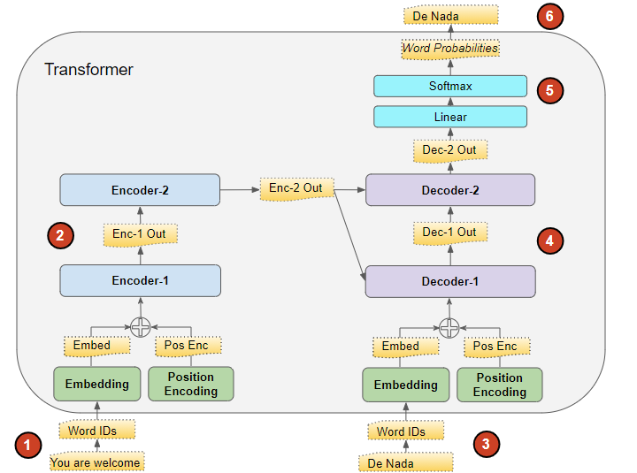
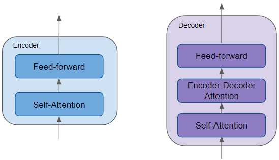
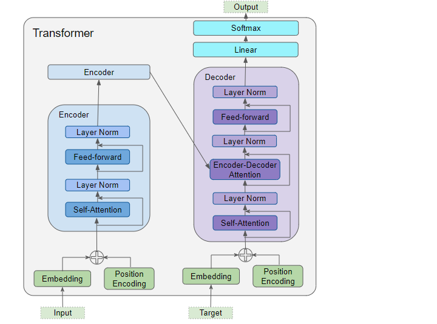

## Transformer



### Overview

First note that a GPT-style transformer is a decoder-only transformer:
- Each token can attend only to previous tokens, because of the causal mask $x_t \text{ can attend to } x_1, \dots x_t$.

For machine translation (e.g., $\text{english} \rightarrow \text{french}$), a encoder-decoder transformer is used:
- No causal mask is used on the encoder. Each encoder token can attend to all other input tokens.
- A causal mask is used on the decoder. The decoder can attend to previous output tokens and the encoder's representation of the full input sequence.
- The encoder stack and decoder stack get their own embedding layers (you wouldn't use english embeddings on french tokens).

Note how both encoder and decoder input get position encoding.



### Layer Details

Include residual connection + layer norm around each attention/FFN sublayer.

- Encoder (encoder-decoder transformer)
  - Unmasked self-attention
    - $Q = H_{enc}W_Q$ 
    - $K = H_{enc}W_K$
    - $V = H_{enc}W_V$
  - FFN
- Decoder (encoder-decoder tranformer)
  - Masked self-attention
  - Encoder-decoder attention (don't need masking here because of the prior masking)
    - The prior self-attention output is the query and the encoder output is the key and value.
    - $Q = H_{dec}W_Q$ 
    - $K = H_{enc}W_K$
    - $V = H_{enc}W_V$
  - FFN
- Decoder (Decoder-only transformer):
  - Masked self-attention
  - FFN



### FFN

We have (B, L, d_model). We apply a 2-layer MLP to d_model only.

This will look like `[d_model] → [d_ff] → [d_model]`.

If `d_model` is 512, we may end up projecting to `d_ff` 2048 then back down to 512.

```python
import jax
import jax.numpy as jnp

def ffn(x, W1, b1, W2, b2):
    """
    x:  [B, T, d_model]
    W1: [d_model, d_ff]
    b1: [d_ff]
    W2: [d_ff, d_model]
    b2: [d_model]
    """

    h = jax.nn.gelu(x @ W1 + b1)  # [B, T, d_ff]
    y = h @ W2 + b2               # [B, T, d_model]

    return y
```