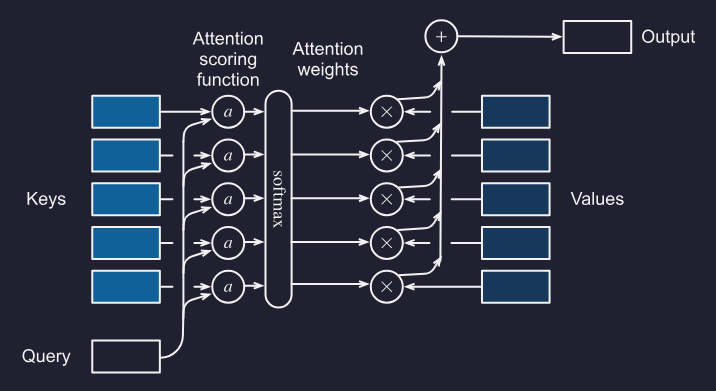

## Issues with RNN
(This section is just because I wanted a record of keywords from the lecture)

Lack of parallelism across time steps within each sequence.
- Sequential dependency: cannot begin step t until step t-1 is complete.
- GPU Underutilisation: RNNs force sequential processing
- Training on long sequences becomes untenable due to time constraints

Transformers are able to process all tokens in all sequences at once (during training). Information flow is controlled by causal masking.

This means:
- Every token attends to every other token (O(1) path length)
- No sequential bottleneck
- "Variable" memory as the entire sequence can be queried for relevant context (dynamic attention routing)

## Queries Key and Values

Let $\mathcal D = \{(\mathbf k_1,\mathbf v_1), \dots, (\mathbf k_m,\mathbf v_m)\}$

Define attention over $\mathcal D$ as:

$$
\text{Attention}(\mathbf q, \mathcal D) \stackrel{\textrm{def}}{=} \sum_{i=1}^m \alpha (\mathbf q, \mathbf k_i) \mathbf v_i
$$

Where each $\alpha(\mathbf{q}, \mathbf{k}_i) \in \mathbb{R}$ are a scalar attention weight. ($i = 1, \ldots, m$)

To ensure all attention weights sum to 1 and are non-negative we just apply the softmax function:

$$
\alpha(\mathbf{q}, \mathbf{k}_i) = \frac{\exp(a(\mathbf{q}, \mathbf{k}_i))}{\sum_j \exp(a(\mathbf{q}, \mathbf{k}_j))}.
$$


To get a final value we use attention pooling:

$$
o = \alpha_1 v_1 + \alpha_2 v_2 + \alpha_3 v_3
$$

## Attention Scoring Functions

### Scaled Dot Production Attention

Assume all elements of query $\mathbf{q} \in \mathbb{R}^d$ and key $\mathbf{k}_i \in \mathbb{R}^d$ are i.i.d. with zero mean and unit variance. The dot product between both vectors has zero mean and unit variance. Therefore to ensure the variance of the dot product remains 1 regardless of vector lenght, we rescale using $1/\sqrt{d}$:

$$
a(\mathbf{q}, \mathbf{k}_i) = \frac{\mathbf{q}^\top \mathbf{k}_i}{\sqrt{d}}
$$

This means overall we get:

$$
\alpha(\mathbf{q}, \mathbf{k}_i) = \mathrm{softmax}(a(\mathbf{q}, \mathbf{k}_i)) = \frac{\exp(\mathbf{q}^\top \mathbf{k}_i / \sqrt{d})}{\sum_{j=1} \exp(\mathbf{q}^\top \mathbf{k}_j / \sqrt{d})}.
$$

Otherwise written as: ($n$ queries and $m$ key-value pairs, where queries and keys are of length $d$ and values are of length $v$)

$$
\mathrm{softmax}\left(\frac{\mathbf Q \mathbf K^\top }{\sqrt{d}}\right) \mathbf V \in \mathbb{R}^{n\times v}
$$

### Multilayer Perceptron Attention (Additive Attention)

Used when $q \in \mathbb R^q$ and $k \in \mathbb R^k$ are different dimensions so dot product not possible.

One option is to address the mismatch with $\mathbf{q}^\top \mathbf{M} \mathbf{k}$ or alternatively we can use additive attention:

$$
a(\mathbf q, \mathbf k) = \mathbf v^\top \textrm{tanh}(\mathbf W_q\mathbf q + \mathbf W_k \mathbf k) \in \mathbb{R}
$$

Where $\mathbf W_q\in\mathbb R^{h\times q}$, $\mathbf W_k\in\mathbb R^{h\times k}$, $\mathbf v\in\mathbb R^{h}$.

We then feed through softmax...

Note don't get confused with the value vector from transformer attention:
| Symbol                        | Meaning                                  | Used where?    |
| ----------------------------- | ---------------------------------------- | -------------- |
| $\mathbf v \in \mathbb R^h$ | **learned parameter vector** for scoring | before softmax |
| $\mathbf V$ or $v_i$       | **value vectors** being pooled           | after softmax  |

## Seq2Seq With Attention (Bahdanau Attention Mechanism)

Dynamically update context variable $c$ as a function of original text (hidden encoder states $h_t$) and text that has been generated (decoder states $s_{t'-1}$). This yields $c_{t'}$ which is updated after any decoding time step $t'$.

Assuming input sequence of length $T$, then:

$$
\mathbf{c}_{t'} = \sum_{t=1}^{T} \alpha(\mathbf{s}_{t' - 1}, \mathbf{h}_{t}) \mathbf{h}_{t}
$$

Note attention weight $\alpha$ is generated using additive attention scoring.

Old writeup:

Basically use the output of the encoder model (T, d) as the keys/values and use the current hidden state of the decoder model as the query.

I.e., $K_i = h_i^{enc}$, $V_i = h_i^{enc}$ or linear projections of them.

Then decoder hidden state $h_t^{dec}$ is used as the query $q_t = h_t^{dec}$ or a linear projection of it.

The our given query over $i$ our keys gives us our context variable $c$:

$$\alpha (q, k_i) = \text{softmax}_i \left ( \frac{q^\top k_i}{\sqrt{d_k}} \right)$$

$$c_t = \sum_i \alpha_{t,i} \cdot v_i$$

Which conditions on every decoder step.



## Positional Encoding

Let $\mathbf X \in \mathbb R^{n\times d}$ with $d$-dimensional embeddings for $n$ tokens of a sequence.

We then form a positional encoding matrix $\mathbf P \in \mathbb R^{n\times d}$:

$$
p_{i,k}
=
\begin{cases}
\sin\left(\dfrac{i}{10000^{k/d}}\right), & k \text{ is even} \\
\cos\left(\dfrac{i}{10000^{(k-1)/d}}\right), & k \text{ is odd}
\end{cases}
$$

Intuitively:
- The position in the sequence $i$ is our "x" axis.
- $k$ and $d$  control the period of the wave. As we walk through the embedding dimension we increase the period of the sine wave (we monotonically decrease frequency along the encoding dimension).

### Absolute positional information

Each position/time step gets a distinct pattern across the positional encoding dimensions.

Binary analog:
```
0 = 000
1 = 001
2 = 010
3 = 011
4 = 100
5 = 101
6 = 110
7 = 111
```

Sinusoidal positional encoding does something similar, but with smooth waves instead of bits:

```
Early dimensions: high frequency = change quickly with position
Later dimensions: low frequency = change slowly with position
```

### Relative positional information

For a fixed offset $\delta$, there is a matrix $M_{\delta,j}$ such that:

$$
M_{\delta,j}
\begin{bmatrix}
p_{i,2j} \\
p_{i,2j+1}
\end{bmatrix}
=
\begin{bmatrix}
p_{i+\delta,2j} \\
p_{i+\delta,2j+1}
\end{bmatrix}
$$

Explanation for this property found at end of document.

<div style="height: 500px;"></div>


## (convenience function) Masked Softmax Operation

When applying attention to sequence models, we may need to deal with sequences of different lengths:

```
Dive  into  Deep    Learning
Learn to    code    <blank>
Hello world <blank> <blank>
```

We need to limit $\sum_{i=1}^n \alpha(\mathbf{q}, \mathbf{k}_i) \mathbf{v}_i$ to $\sum_{i=1}^l \alpha(\mathbf{q}, \mathbf{k}_i) \mathbf{v}_i$ however long $l \leq n$, the actual sentence is.


## Relative positional information explanation

Use a 4-dimensional example:

$$
\vec v_t =
\begin{bmatrix}
\sin(t) \\
\cos(t) \\
\sin\left(\frac{t}{\eta_1}\right) \\
\cos\left(\frac{t}{\eta_1}\right)
\end{bmatrix}
$$

After shifting by a fixed offset $\delta$:

$$
\vec v_{t+\delta} =
\begin{bmatrix}
\sin(t+\delta) \\
\cos(t+\delta) \\
\sin\left(\frac{t+\delta}{\eta_1}\right) \\
\cos\left(\frac{t+\delta}{\eta_1}\right)
\end{bmatrix}
$$

Using:

$$
\sin(\alpha+\beta)=\sin(\alpha)\cos(\beta)+\cos(\alpha)\sin(\beta)
$$

$$
\cos(\alpha+\beta)=\cos(\alpha)\cos(\beta)-\sin(\alpha)\sin(\beta)
$$

we get:

$$
\vec v_{t+\delta}
=
\begin{bmatrix}
\sin(t)\cos(\delta) + \cos(t)\sin(\delta) \\
\cos(t)\cos(\delta) - \sin(t)\sin(\delta) \\
\sin\left(\frac{t}{\eta_1}\right)\cos\left(\frac{\delta}{\eta_1}\right)
+
\cos\left(\frac{t}{\eta_1}\right)\sin\left(\frac{\delta}{\eta_1}\right) \\
\cos\left(\frac{t}{\eta_1}\right)\cos\left(\frac{\delta}{\eta_1}\right)
-
\sin\left(\frac{t}{\eta_1}\right)\sin\left(\frac{\delta}{\eta_1}\right)
\end{bmatrix}
$$

This can be written as a matrix multiplication:

$$
\vec v_{t+\delta}
=
\begin{bmatrix}
\cos(\delta) & \sin(\delta) & 0 & 0 \\
-\sin(\delta) & \cos(\delta) & 0 & 0 \\
0 & 0 & \cos\left(\frac{\delta}{\eta_1}\right) & \sin\left(\frac{\delta}{\eta_1}\right) \\
0 & 0 & -\sin\left(\frac{\delta}{\eta_1}\right) & \cos\left(\frac{\delta}{\eta_1}\right)
\end{bmatrix}
\begin{bmatrix}
\sin(t) \\
\cos(t) \\
\sin\left(\frac{t}{\eta_1}\right) \\
\cos\left(\frac{t}{\eta_1}\right)
\end{bmatrix}
$$

So:

$$
\vec v_{t+\delta} = M_\delta \vec v_t
$$

The key idea is that for any fixed relative offset $\delta$, the same matrix $M_\delta$ maps the positional encoding at position $t$ to the positional encoding at position $t+\delta$.

$M_\delta$ depends on $\delta$, but not on $t$.