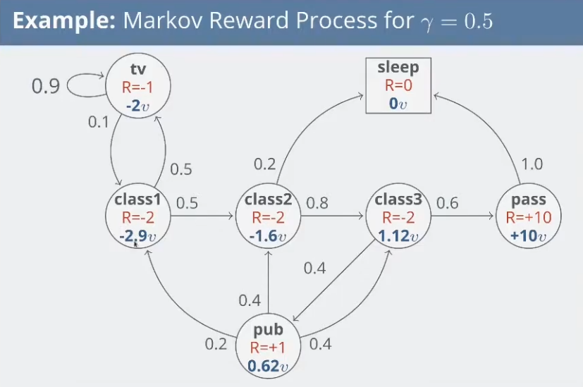

### Markov Chains

#### Markov Property
A state $S_t$ is Markov if and only if:

$$
P(S_{t+1} \mid S_t) = P(S_{t+1} \mid S_1, S_2, \ldots, S_t)

$$

That is, the current state fully characterises the distribution over future events:

$$
H_{1:t} \rightarrow S_t \rightarrow H_{t+1:\infty}

$$

E.g., a chess board, you do not need to know the moves played up to the currenct state of the game to inform future state.

#### State transition matrix
Describes the probability of transitioning from one state to another.

The probability of transition from state $s$ to $s'$ is:

$$
P_{ss'} = P(S_{t+1} = s' \mid S_t = s)

$$

Which is canonically represented as the state transition matrix:

$$
\mathbf{P} =
\begin{bmatrix}
P_{11} & \cdots & P_{1n} \\
\vdots & \ddots & \vdots \\
P_{n1} & \cdots & P_{nn}
\end{bmatrix}

$$

The rows represent origin states and the columns represent destination states.

#### Markov Chain
(also called Markov Process) Is the set of states and a state-transition matrix: $\langle S, \mathcal{P} \rangle$ where:

- $\mathcal{S}$ is a finite set of states
- $\mathcal{P}$ is the state transition matrix where $\mathcal{P}_{ss'}=P(S_{t+1}=s' | S_t = s)$

#### Markov episode
Is a finite sequence of states generated by following the chain until termination: $S_1, S_2, \dots, S_T$

#### Markov reward process
A Markov Chain with a reward function: $\langle \mathcal{S, P, R, \gamma}\rangle$ where:

- $\mathcal{S}$ is a finite set of states
- $\mathcal{P}$ is the **state transition matrix** where $\mathcal{P}_{ss'}=P(S_{t+1}=s' | S_t = s)$
- $\mathcal{R}$ is a **reward function** where $\mathcal{R}_s=\mathbb{E}[R_{t+1}|S_t = s]$
- $\gamma$ is the **discount** rate $\gamma \in [0,1]$

Just expanding on the reward function: if you are in **state (a)** at time (t), the **reward function $R(a)$** is:

$$
R(a) = \mathbb{E}[R_{t+1} \mid S_t = a]

$$

This is the **expected immediate reward you get when leaving state (a)**. By convention, it’s said that the reward is received after the agent leaves the state, and is hence regarded as $R_{t+1}$.

For the below Markov Reward Process:

$$
R(\text{tv}) = \mathbb{E}[R_{t+1} \mid S_t = \text{tv}] = -1

$$

* $R(\text{class1}) = -2$
* $R(\text{class2}) = -2$
* $R(\text{class3}) = -2$
* $R(\text{pub}) = +1$
* $R(\text{pass}) = +10$
* $R(\text{sleep}) = 0$

#### Return
The return $G_t$, in the simplest case, is the total future reward:

$$
G_t = R_{t+1} + R_{t+2} + R_{t+3} + \dots + R_T.

$$

In practice, we discount rewards into the future by the discount rate $\gamma \in [0,1]$:

$$
G_t = R_{t+1} + \gamma R_{t+2} + \gamma^2 R_{t+3} + \dots
= \sum_{k=0}^{\infty} \gamma^k R_{t+k+1}.

$$

Remember that each $R$ is a random variable.

#### State value function
($V(s)$) The long-term value of a state:

$$
V(s) = \mathbb{E}[G_t \mid S_t = s]

$$

This may be calculated for example by sampling episodes.

#### Bellman equations
A way of decopmosing the value finction into the immediate reward $R_{t+1}$ and the discounted value of the next state $\gamma \cdot v(S_{t+1})$

$$
\begin{align}
V(s) &= \mathbb{E}\left[G_t \mid S_t = s\right] \\
 &= \mathbb{E}\left[R_{t+1} + \gamma R_{t+2} + \gamma^2 R_{t+3} + \gamma^3 R_{t+4} + \dots \mid S_t = s\right] \\
 &= \mathbb{E}\left[R_{t+1} + \gamma \left( R_{t+2} + \gamma R_{t+3} + \gamma^2 R_{t+4} + \dots \right) \mid S_t = s\right] \\
 &= \mathbb{E}[R_{t+1} + \gamma G_{t+1} \mid S_t = s] \\
 &= \mathbb{E}[R_{t+1} + \gamma v(S_{t+1}) \mid S_t = s]
\end{align}

$$

Which is equivalent to:

$$
V(s) = \mathcal{R_s} + \gamma \sum_{s'\in\mathcal{S}} \mathcal{P}_{ss'} \cdot v(s')

$$

Remember $\mathcal{P}$ is the transitional probabilities.

Which can be expressed in matrices:

$$
\begin{bmatrix}
v(1) \\
\vdots \\
v(n)
\end{bmatrix}
=
\begin{bmatrix}
R_1 \\
\vdots \\
R_n
\end{bmatrix}
+ \gamma
\begin{bmatrix}
P_{11} & \cdots & P_{1n} \\
\vdots & \ddots & \vdots \\
P_{n1} & \cdots & P_{nn}
\end{bmatrix}
\begin{bmatrix}
v(1) \\
\vdots \\
v(n)
\end{bmatrix}

$$

which is a linear equation that can be solved:

$$
\begin{aligned}
v &= R + \gamma P v \\
(I - \gamma P)v &= R \\
v &= (I - \gamma P)^{-1} R,
\end{aligned}

$$

where $I$ is the identity matrix. Unfortunately, this matrix inversion is too slow, except for small MDPs, so we use iterative methods for larger MDPs (MC evaluation and TD learning).

Verifying the bellman equation:

#### Markov Decision Process
Adds 'actions' to the Markov Reward Process so the transition probability matrix now depends on which action the agent takes.

A **Markov decision process** is a tuple $\langle \mathcal{S, A, P, R, \gamma} \rangle$:

- $\mathcal{S}$ is a finite set of states
- $\mathcal{A}$ is a finite set of actions
- $\mathcal{P}$ is the **state transition matrix** where $\mathcal{P}_{ss'}^{a}=P(S_{t+1}=s' | S_t = s, A_t = a)$
- $\mathcal{R}$ is a **reward function** where $\mathcal{R}_s^{a}=\mathbb{E}[R_{t+1}|S_t = s, A_t = a]$
- $\gamma$ is the **discount** rate $\gamma \in [0,1]$

#### Policy

A policy $\pi$ is a distribution over actions given a state:

$$
\pi(a \mid s) = P(A_t=a \mid S_t = s)
$$

#### State value function (Markov Decision Process)
The state value function $v_\pi$ is the same, but is the return when following a given policy $\pi$:

$$v_\pi = \mathbb{E}_\pi[G_t \mid S_t = s]$$

#### Action value function
The action value function is the long term value of a state when choosing an action with policy $\pi$:
$$
q_\pi(s, a) = \mathbb{E}_\pi[G_t \mid S_t = s, A_t = a]
$$

#### State value function (the Bellman equation)
Similarly to MRPs, the state-value function can be decomposed into the immediate reward and the discounted value of the next state:

$$
\begin{aligned}
v_{\pi}(s) &= \mathbb{E}_{\pi}[G_t \mid S_t = s] \\
&= \mathbb{E}_{\pi}[R_{t+1} + \gamma v_{\pi}(S_{t+1}) \mid S_t = s] \\
&= \sum_{a \in \mathcal{A}} \pi(a \mid s) q_{\pi}(s, a),
\end{aligned}
$$

which is also the case for the action-value function, where:
$$
\begin{aligned}
q_{\pi}(s, a) &= \mathbb{E}_{\pi}[G_t \mid S_t = s, A_t = a] \\
&= \mathbb{E}_{\pi}[R_{t+1} + \gamma q_{\pi}(S_{t+1}, A_{t+1}) \mid S_t = s, A_t = a] \\
&= R_s^a + \gamma \sum_{s' \in \mathcal{S}} P_{ss'}^{a} v_{\pi}(s').
\end{aligned}
$$

#### Optimal state value function
The maximum value function over all policies:

$$v_* = \max_\pi v_\pi (s)$$

#### Optimal action value function
The maximum action value function over all policies:
$$ q_* (s,a) = \max_\pi q_\pi(s,a)$$

